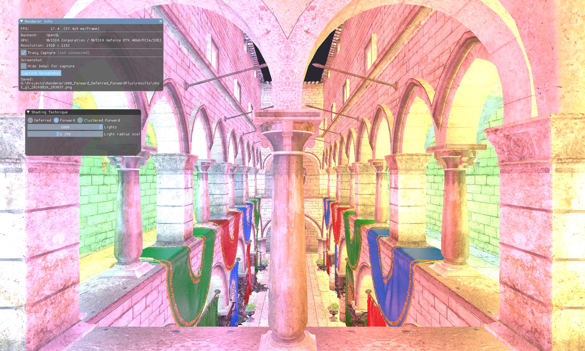
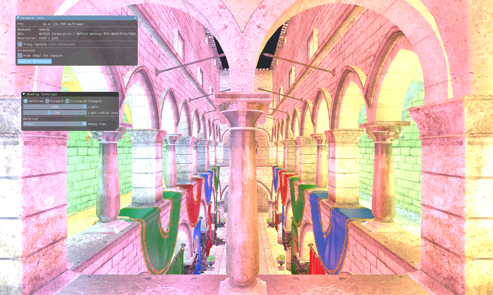
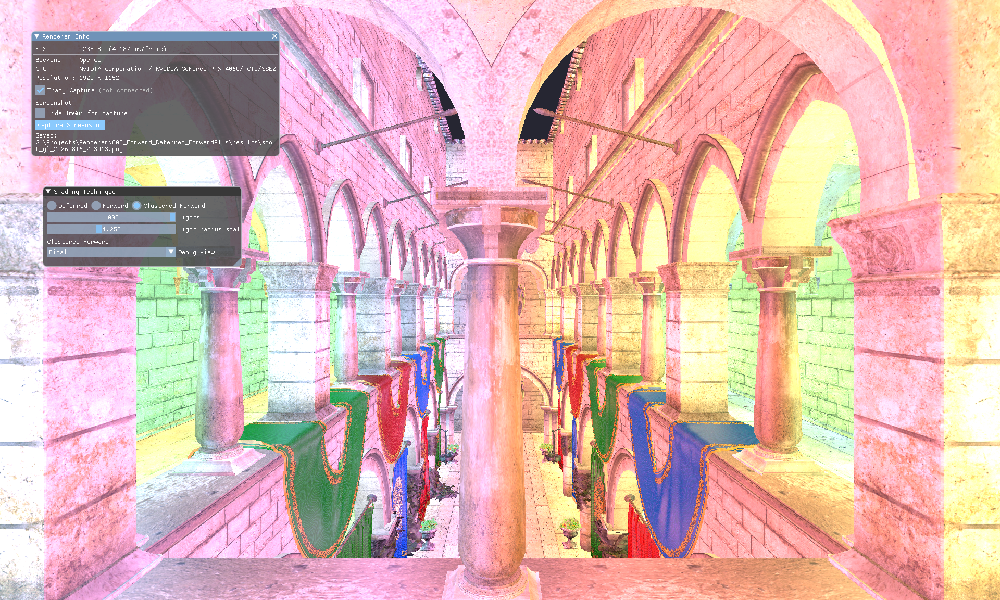

# 000 — Forward / Deferred / Clustered Forward

同一场景、同一套灯、同一套 BRDF 下三种着色算法的开销对比。

## 编译与启动

在仓库任意目录执行：

- 编译：`000_Forward_Deferred_ForwardPlus\Build\build_debug.bat`
- 运行：`000_Forward_Deferred_ForwardPlus\Build\run_debug.bat`
- 可选：`run_debug.bat --backend=vk`

## 测试条件

| 项 | 值 |
| --- | --- |
| GPU | NVIDIA GeForce RTX 4060 |
| 后端 | OpenGL（`--backend=gl`，Debug 构建） |
| 分辨率 | 1920 × 1152 |
| 场景 | Sponza，AABB `(-3.85, -2.62, -6.26)` ~ `(3.85, 2.62, 6.26)` |
| 点光源 | 1000 盏，按 AABB 内 10×10×10 网格铺开，5 种色相循环，强度 2.5 |
| 灯半径 | 网格单元对角线 × 1.25 ≈ 1.64 m |
| BRDF | 视空间 Blinn-Phong，环境 `albedo × 0.08`，高光指数 32，半径线性衰减取平方 |
| 相机 | FOV 60°，near 0.1，far 100 |
| 计时 | 默认 Overlay 的 FPS / 帧时（含 ImGui 绘制） |

三种算法读同一份 `SharedShadingParams`，光源 UBO 布局也相同（`LightBlockData`，32016 B），所以差异只来自光照的组织方式。

## 结果总览

| 算法 | 帧时 | FPS | 相对 Deferred | 相对 Forward |
| --- | --- | --- | --- | --- |
| Forward | 57.419 ms | 17.4 | 0.38× | 1.00× |
| Deferred | 21.555 ms | 46.4 | 1.00× | 2.66× |
| Clustered Forward | 4.187 ms | 238.8 | 5.15× | 13.71× |

三者的最终画面一致（下面截图的差异只在 ImGui 面板上）。

**Forward** — 57.419 ms

**Deferred** — 21.555 ms

**Clustered Forward** — 4.187 ms

