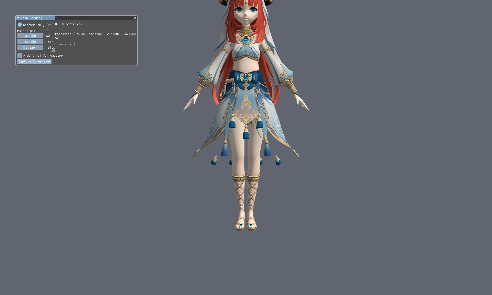
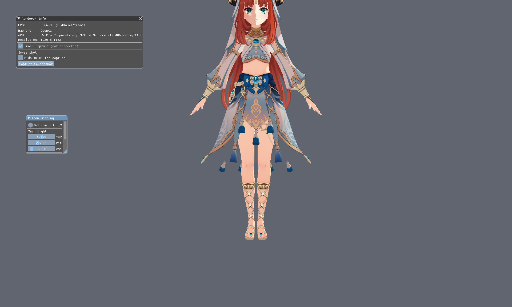

# 003 — Toon Shading

## 编译与启动
在仓库任意目录执行：
- 编译：`003_Toon_Shading\Build\build_debug.bat`
- 运行：`003_Toon_Shading\Build\run_debug.bat`
- 可选：`run_debug.bat --backend=vk`

## 包含的算法
- Diffuse Only
- Cel Ramp

## 算法结果

