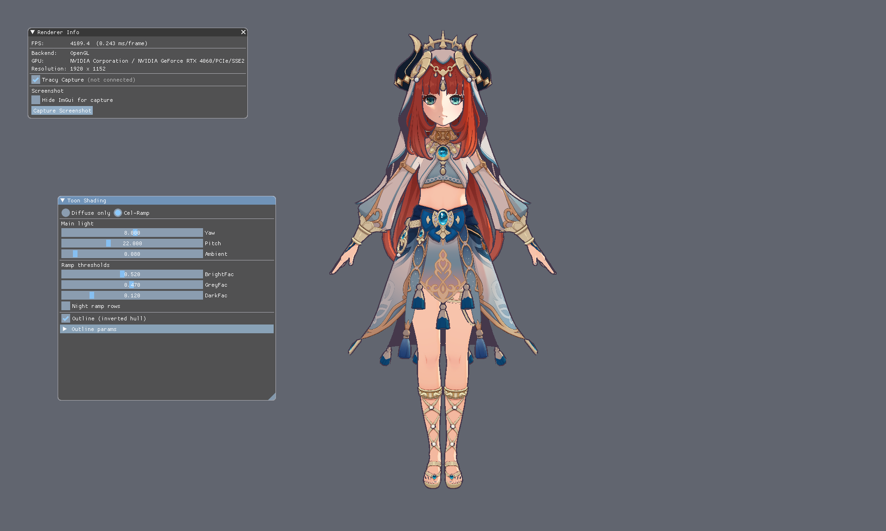

# 003 — Toon Shading

妮露 Diffuse Only、Cel-Ramp 与背面外扩描边。

## 编译与启动

在仓库任意目录执行：

- 编译：`003_Toon_Shading\Build\build_debug.bat`
- 运行：`003_Toon_Shading\Build\run_debug.bat`
- 可选：`run_debug.bat --backend=vk`
- 可选：`run_debug.bat --mode=diffuse` 或 `--mode=celramp`（默认 Cel-Ramp + 描边）

## 测试条件

| 项 | 值 |
| --- | --- |
| GPU | NVIDIA GeForce RTX 4060 |
| 后端 | OpenGL（`--backend=gl`，Debug 构建） |
| 分辨率 | 1920 × 1152 |
| 场景 | Nilou，AABB `(-0.42, -0.01, -0.35)` ~ `(0.42, 1.63, 0.26)`，贴地后身高约 1.8 m |
| 相机 | 位置 `(0, 1.35, 3.4)`，yaw `-90°`，pitch `-8°`，FOV `35°`，near `0.05`，far `40` |
| 主光 | yaw `8°`，pitch `22°`，ambient `0.08` |
| Ramp | bright `0.52` / grey `0.47` / dark `0.12`，日间行 |
| 描边线宽 | 基础 `2.5` px，钳在 `0.8` ~ `6.0` px；refDistance `3.4` m，falloffPower `0.5` |
| 描边淡出 | fade `8` ~ `25` m，强度 `0.85`，目标色 `(0.30, 0.30, 0.34)` |
| 描边分部件 | 四个部件同色 `(0.06, 0.04, 0.07)`；线宽倍率 Body / Dress / Hair `1.0`，Face `0.6` |
| 描边 Z bias | `0` m（视空间沿相机方向偏移） |

## 包含的算法

- **Diffuse Only**：只采样漫反射贴图，不走半 Lambert / Ramp。
- **Cel-Ramp**：半 Lambert × ilm 采 Shadow Ramp，分亮 / 灰 / 暗三档。
- **背面外扩描边**：正面剔除 + 沿平滑法线挤出，叠在 Cel-Ramp 上。
  - 平滑法线在上传 GPU 前烘进顶点的 tangent 槽：跨 mesh 按位置聚合邻面，
    只平均夹角 85° 以内的那些。模型 80016 个顶点只对应 13806 个唯一位置，
    其中三分之一带分裂法线，直接用原始硬边法线外扩会把壳体在硬边与 UV 缝处
    撕开；角度阈值同时避免裙摆、发片这类背靠背双面片的法线互相抵消。
  - 外扩方向在像素空间归一化，线宽屏幕空间等宽，不随宽高比与深度变化。
  - 线宽随视距按 `pow(clamp(refDistance / viewZ, 0, 1), falloffPower)` 收细并
    钳在 min / max 之间；更远处描边色向淡色过渡，避免小人被粗黑线糊成一团。
  - 描边色与线宽倍率按部件（Body / Dress / Hair / Face）分别配置，倍率为 0
    即该部件不描边。

## 算法结果

**Diffuse Only**

**Cel-Ramp**

**背面外扩描边**

