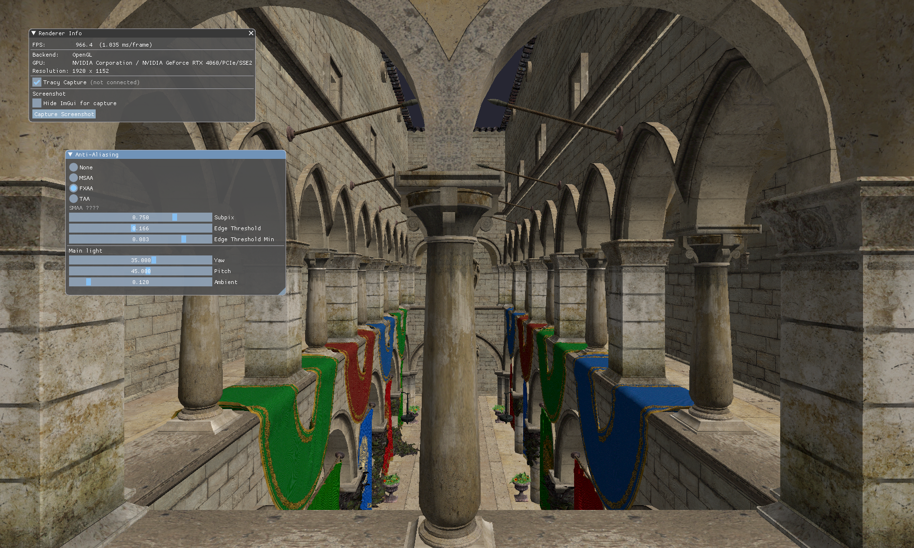
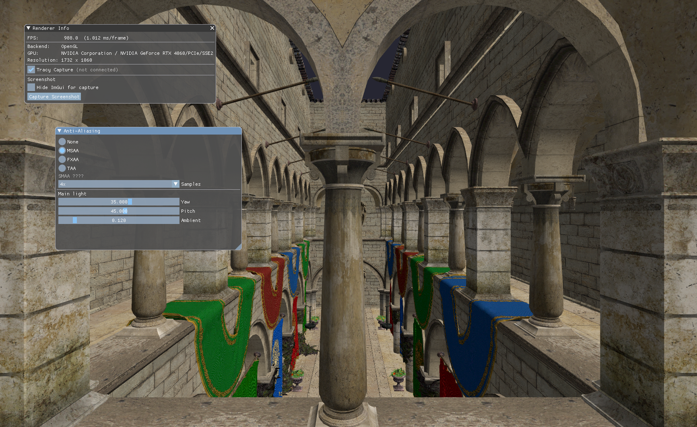
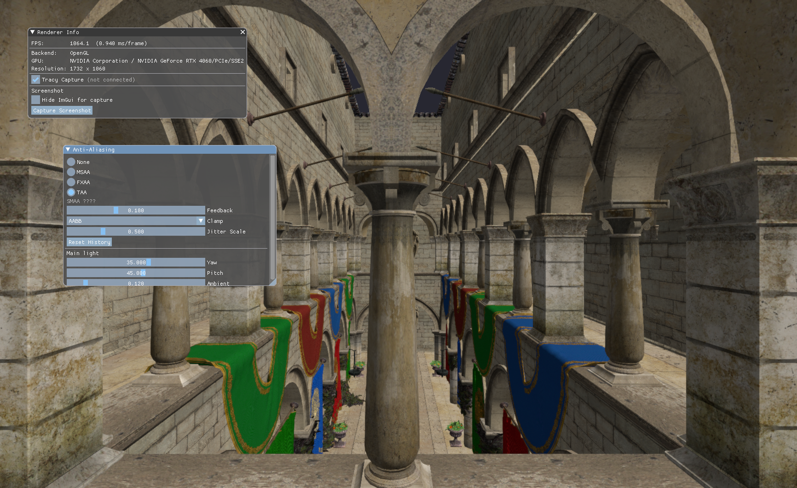
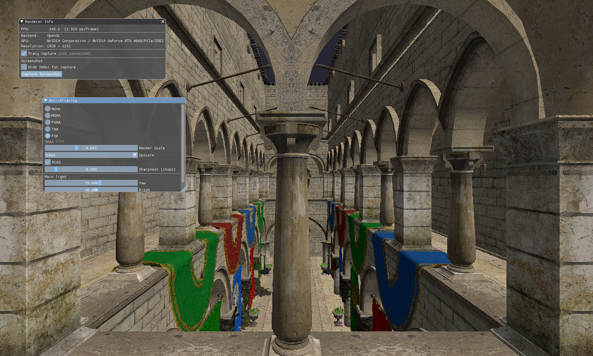

# 004 — Anti-Aliasing

同一 Sponza 场景下对比抗锯齿方案。当前接入无 AA 基线、硬件 MSAA、FXAA、TAA、FSR1.0 与 FSR2.0；SMAA 尚未实现。

## 编译与启动

在仓库任意目录执行：

- 编译：`004_Anti_Aliasing\Build\build_debug.bat`
- 运行：`004_Anti_Aliasing\Build\run_debug.bat`
- 可选：`run_debug.bat --backend=vk`
- 可选：`run_debug.bat --mode=msaa` / `--mode=fxaa` / `--mode=taa` / `--mode=fsr` / `--mode=fsr2`（默认 None）

## 包含的算法

- **None**：无抗锯齿，Sponza 漫反射 ×（环境 + Lambert），画到默认 backbuffer。
- **MSAA**：前向画到离屏 multisample RT，硬件 resolve 到 1-sample 后再拷回 backbuffer。采样数可在 overlay 里选 2x / 4x / 8x。MSAA 与 Deferred 不兼容（per-sample 着色代价高），本示例走前向路径。
- **FXAA**：前向画到离屏 LDR，再按 Lottes FXAA 3.11 Quality 做 luma 边缘检测与沿边混合，直接写回 backbuffer。无历史帧。Overlay 可调 Subpix、Edge Threshold、Edge Threshold Min。
- **TAA**：Halton(2,3) 子像素 jitter 画颜色 + RG16F velocity，按上一帧 view-proj 重投影 HDR history，邻域 AABB / variance clip 压鬼影后写回双缓冲。Overlay 可调 Feedback、Clamp、Jitter Scale。
- **FSR1.0**：AMD FidelityFX Super Resolution 1.0，纯空间超分，不用运动向量和历史帧。场景先按 Render Scale 画到低分辨率离屏 LDR，EASU 用亮度估计边缘方向与强度、把带负瓣的 Lanczos 近似核旋到边缘坐标系做各向异性重建，放大到显示分辨率；RCAS 再在十字 5 点邻域上做受限锐化写回 backbuffer。Overlay 可调 Render Scale、上采样方式（Bilinear 对照 / EASU 12 tap / Mobile EASU 6 tap）、RCAS 开关与锐化档位。
- **FSR2.0**：AMD FidelityFX Super Resolution 2.0，时域超分。场景按独立的 Render Scale 做 Halton jitter 前向渲染，输出颜色、UV 速度和视空间深度；显示分辨率上用 Lanczos-2 重建当前帧，按最近深度膨胀后的运动向量回看 history，邻域 AABB / variance clip 压鬼影，深度不连续时少信历史。最后只读复用 FSR1.0 的 RCAS shader 锐化写回 backbuffer。参数与 FSR1.0 分开，互不影响。Overlay 可调 Render Scale、Feedback、Clamp、Jitter Scale、RCAS。
- SMAA：待接入。

## 算法结果

