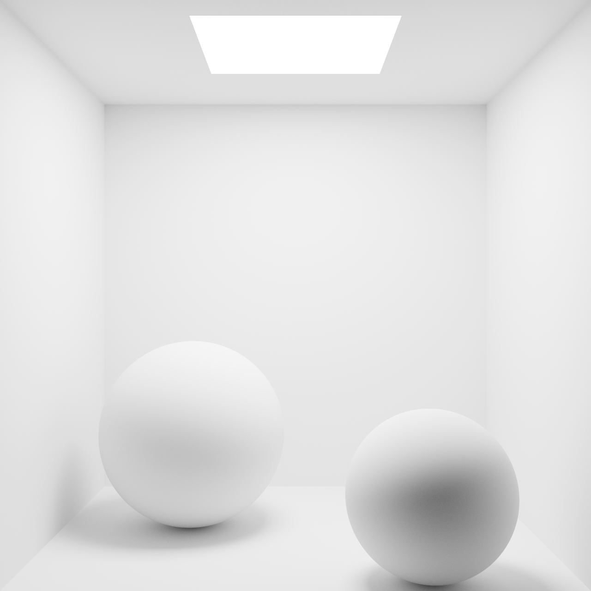
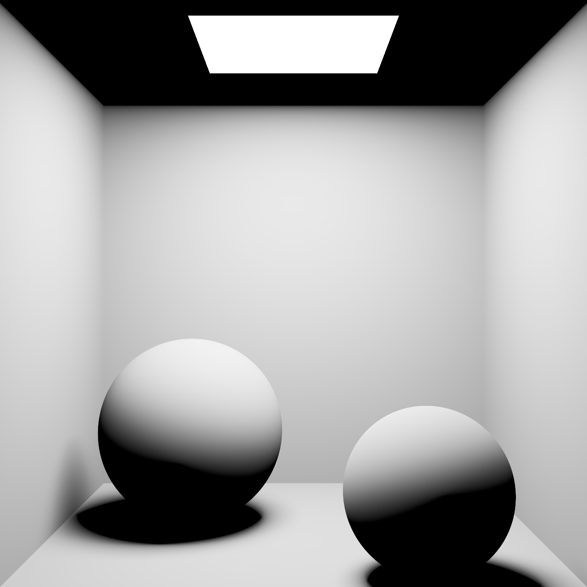
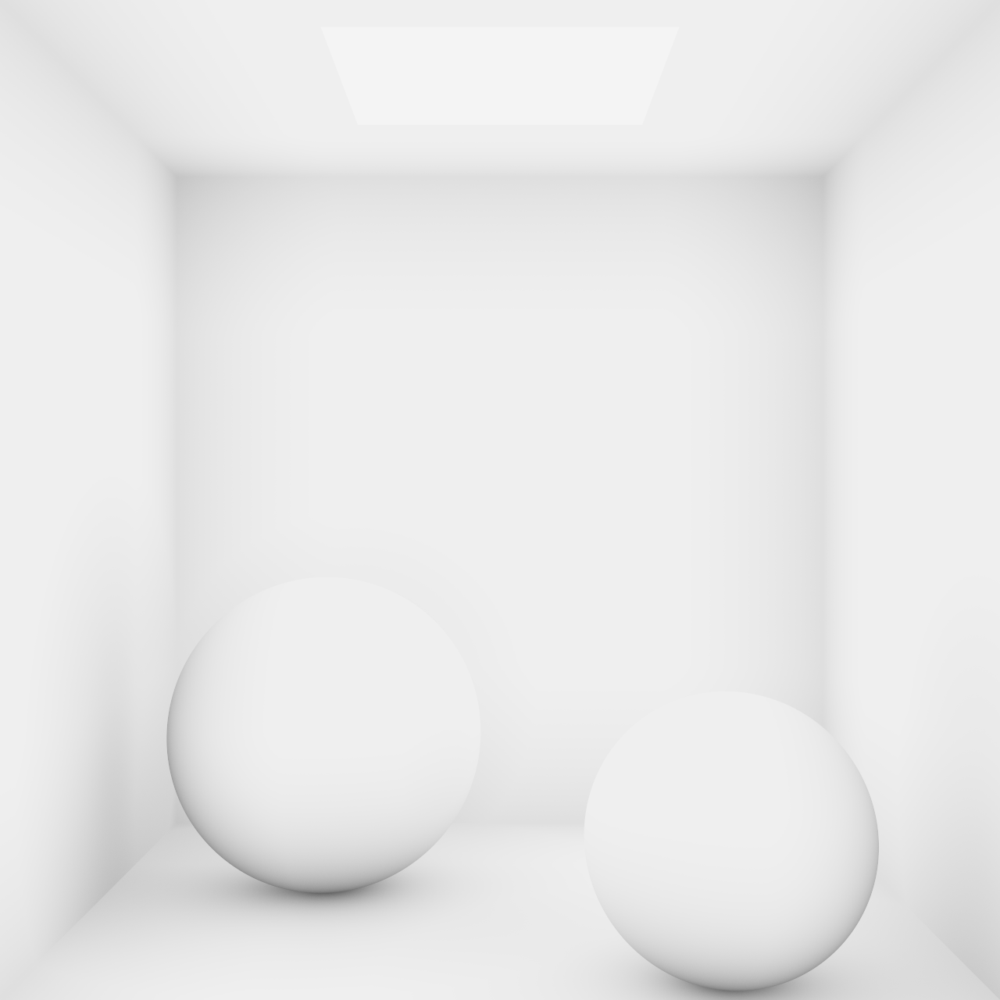
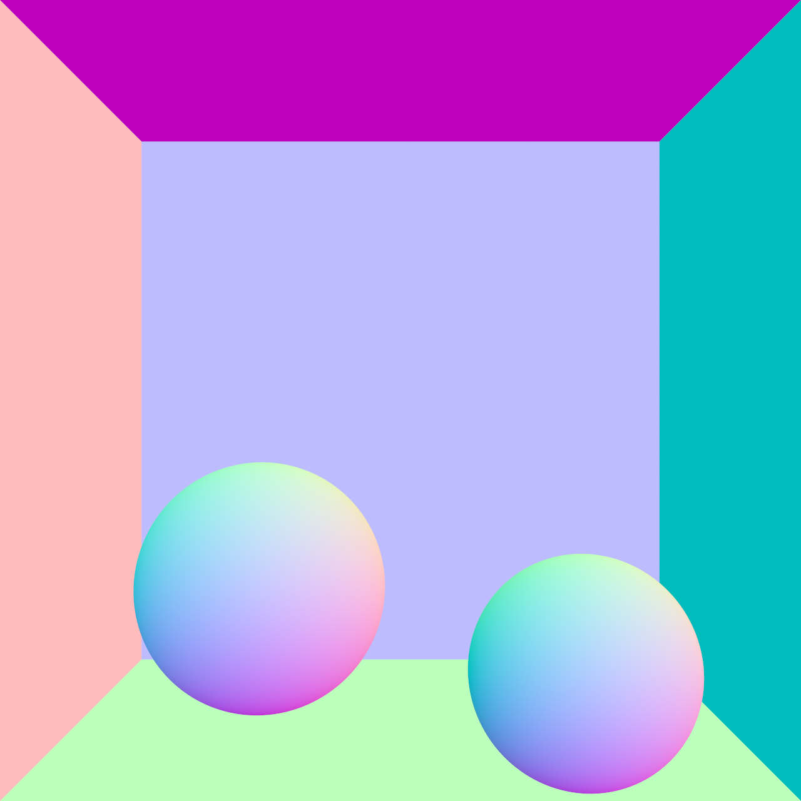

# 005 — Software Path Tracing

软件路径追踪测试台（片元着色器里解析求交，不走 RT Core）。场景是空的 Cornell Box 加两个互不相交的球，**所有物体共用同一份白色漫反射材质**，唯一光源是贴着天花板、法线朝下的矩形面光源。

场景全部是解析几何（五面墙 + 两个球 + 一个矩形光源），**不建加速结构、不上传任何 mesh**，求交直接在片元着色器里算，因此 OpenGL 和 Vulkan 跑的是同一份 shader，默认后端就是 GL。

几何和材质都被压到最简：没有贴图、没有法线扰动、没有彩色墙，画面上的任何差异都只可能来自光线传输算法本身。换算法、调采样数，噪点和收敛速度的区别看得很直接。

## 编译与启动

在仓库任意目录执行：

- 编译：`005_Software_Path_Tracing\Build\build_debug.bat`
- 运行：`005_Software_Path_Tracing\Build\run_debug.bat`
- 可选：`run_debug.bat --backend=vk`
- 可选：`run_debug.bat --mode=normal` / `--mode=direct` / `--mode=ao` / `--mode=pt`（默认 `pt`）
- 可选：`run_debug.bat --no-gui`——关掉 ImGui overlay，配合 `--screenshot-at` 出干净的对比图

相机是内置飞行相机（WASD + 鼠标右键拖拽）。初始机位在盒外正对开口，fovY 40°，和 Cornell Box 原始机位一致。

## 场景

| 物件 | 参数 |
| --- | --- |
| 盒子内壁 | `(-2, 0, -2)` – `(2, 4, 2)`，**只有五面墙**，`+Z` 那面是开口 |
| 球 0 | 球心 `(-0.90, 0.80, -0.60)`，半径 `0.80` |
| 球 1 | 球心 `(0.95, 0.60, 0.80)`，半径 `0.60` |
| 面光源 | 天花板下 `0.02`，中心 `(0, 3.98, 0)`，半边长 `0.75 × 0.75`，辐射亮度 `12` |
| 漫反射率 | `0.73`（Cornell Box 原始数据里白漆的反射率），盒壁与两球共用 |

两球球心距 `2.33`、半径和 `1.40`，留出约 `0.93` 的间隙，互不相交；两球都恰好落在地板上（球心高度 = 半径）。overlay 里可以拖球心和半径，拖到相交或穿墙时会给出提示。

盒子只有五面墙是刻意的：相机站在盒内的话，透视决定了对面墙和近处地板不可能同时进画面。开口那一面同时也让间接光有地方逸出，和真实 Cornell Box 一致。

## 包含的算法

- **Normal**：法线可视化。只做求交、把法线编码成颜色，用来确认求交与法线朝向没写错（左墙粉、右墙青、天花板品红、地板浅绿、后墙淡紫）。这一模式的输出是方向数据而不是辐射亮度，所以整条曝光 / 色调映射 / gamma 都被跳过。
- **Direct Light**：只算一次可见性加面光源直接光。面光源上均匀采点，把面积 pdf 换算到立体角，采样数就是半影质量的旋钮——取 1 时半影全是噪点，加大之后才平滑。天花板在这个模式下是纯黑，因为面光源单面朝下发光，天花板拿不到直接光，要靠间接光才会亮起来。
- **Ambient Occlusion**：半球余弦采样的射线 AO，命中距离小于 AO 半径就算被遮。刻意不带光源，只看几何遮蔽量，方便和光栅化路线里的屏幕空间 AO 对照。
- **Path Tracing**：余弦重要性采样 + 面光源直接采样（NEE）+ 俄罗斯轮盘。余弦 pdf 和 Lambert BRDF 完全约掉，所以 throughput 每次弹射只乘 albedo；又因为所有物体共用同一个白色 albedo，多次弹射的能量衰减看得很清楚。overlay 里可以关掉 NEE 做对照：只靠余弦采样去撞天花板那块灯，噪点会大一大截。

## 逐帧累积

相机静止时逐帧往累积缓冲里加样本，缓冲是两张 `RGBA32F` 轮转（读一张写一张），存的是**线性均值**。相机一动、采样参数一改、窗口一缩放，样本数就清零重来。

- 用 32F 而不是 16F：均值累到几百样本之后，新样本的权重 `1/N` 在 16F 的尾数上会被直接舍掉，画面会停在半收敛状态。
- 曝光与色调映射放在单独一趟显示 pass 里，所以拖这两项不用重新累积。
- 样本数到 `Max Accum` 上限后整趟跳过求交，画面完全稳定下来，也不再白烧 GPU。

## 算法结果

