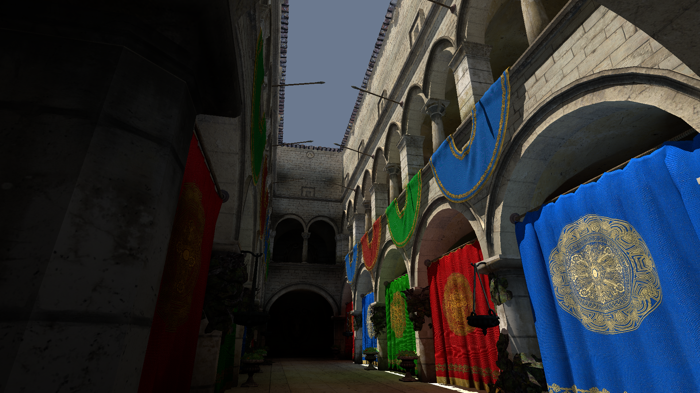
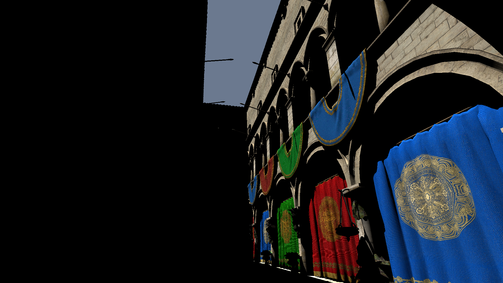
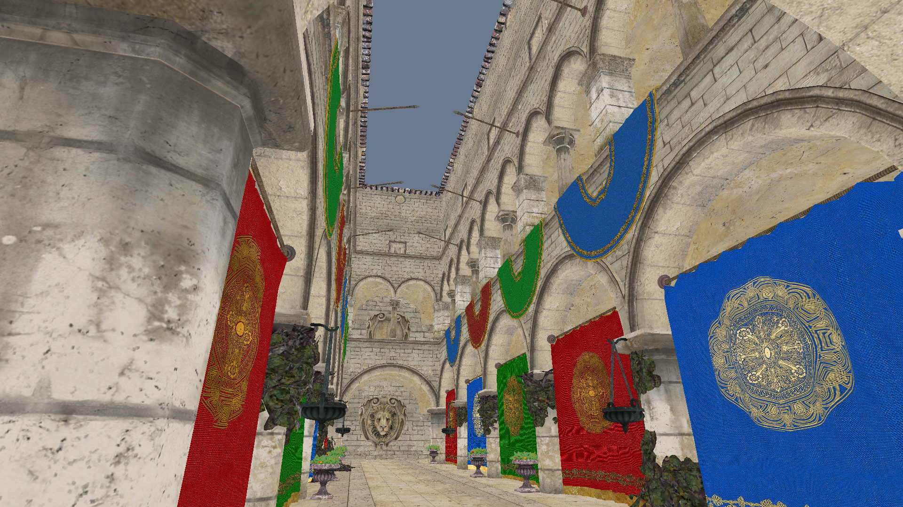

# 006 — Dynamic Diffuse GI

Sponza 上的 Dynamic Diffuse Global Illumination。几何走光栅化 GBuffer，probe 场用 **Compute + `rayQuery`**（RT Core 加速结构）更新，最后在延迟着色里采样 irradiance volume。

默认 **Vulkan**。没有 `VK_KHR_ray_query` 或切 `--backend=gl` 时，probe 不更新，画面只剩太阳直接光，overlay 会提示。

## 编译与启动

在仓库任意目录执行：

- 编译：`006_Dynamic_Diffuse_GI\Build\build_debug.bat`
- 运行：`006_Dynamic_Diffuse_GI\Build\run_debug.bat`
- 可选：`run_debug.bat --backend=vk`
- 可选：`run_debug.bat --view=combined` / `--view=direct` / `--view=gi` / `--view=albedo` / `--view=normal`
- 可选：`run_debug.bat --no-gui`，配合 `--screenshot-at` 出干净对比图

相机是内置飞行相机（WASD + 鼠标右键拖拽）。Overlay 的 **Print camera** 会把当前 pos / yaw / pitch / front 打到日志。

## 测试条件

| 项 | 值 |
| --- | --- |
| GPU | NVIDIA GeForce RTX 4060 |
| 后端 | Vulkan（`--backend=vk`，Debug 构建；需要 `VK_KHR_ray_query`） |
| 分辨率 | 1920 × 1080 |
| 场景 | Sponza，AABB `(-3.85, -2.62, -6.26)` ~ `(3.85, 2.62, 6.26)` |
| 相机 | 位置 `(-0.50, -1.89, 3.62)`，yaw `-78.3°`，pitch `23.0°`，FOV `60°`，near `0.1`，far `80` |
| Probe 网格 | `8 × 6 × 12`（576 个），间距约 `1.04 × 0.96 × 1.10` m，每 probe 64 根射线 |
| Atlas | irradiance / 深度矩各一张，`80 × 720`（每 probe `8×8` 八面体 + 1 圈边框） |
| 太阳 | 照射方向 `(0.32, -1.0, 0.18)`，色 `(1.00, 0.96, 0.88)`，强度 `3.2` |
| 天空 | `(0.42, 0.55, 0.78)` |
| 时域 | hysteresis `0.97`，bounce scale `0.85`，GI intensity `1.35`，最大射线距离 `18` |

网格尺寸在 Init 时按 AABB 算死，overlay 里改不了（改了要重建 atlas）。太阳方向、强度、hysteresis、bounce 可以在运行时拖。

## 包含的算法

- **GBuffer**：Sponza 世界空间 Albedo / Normal / Position + Depth。
- **DDGI Trace**：每个 probe 64 根球面 Fibonacci 射线（整套方向每帧随机旋转），对 Sponza TLAS 做 `rayQuery`；命中后插值烘好的顶点 albedo，打一根太阳阴影射线，再回采上一帧的 probe 场得到后续弹射。反馈增益是 `albedo × bounceScale`，必须小于 1，否则时域迭代会自激发散。
- **DDGI Blend / Border**：把射线归约进 8×8 八面体 irradiance + 深度矩，时域 hysteresis 混合，并补一圈边框给双线性采样。irradiance 用余弦权重，深度矩用锐化权重并按最大射线长度归一化。
- **RT 太阳阴影**：全屏 compute 从 GBuffer 世界坐标打 shadow ray，写一张 mask 给延迟着色的直接光用，和 probe 里的直接光同一套判据。
- **DDGI Shade**：8 邻域三线性插值 + Chebyshev 可见性，和带阴影的 Lambert 直接光合成。

Overlay 可切 Combined / Direct / GI / Albedo / Normal，并可画出 probe 立方体；**Reset probes** 清掉时域历史重积。

## 算法结果

**DDGI** — Combined：带阴影的直接光 + irradiance volume

**Direct** — 只有带 RT 阴影的 Lambert 太阳光

**Albedo** — GBuffer 漫反射

