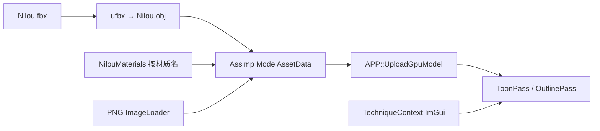

# 003_Toon_Shading 技术方案

> 状态：**M2 已实现（Cel-Ramp）**。本文描述卡通渲染示例的需求、资产语义与架构边界；可勾选任务见 [`003_Toon_Shading_Tasks.md`](003_Toon_Shading_Tasks.md)。
> 相关：[`Todo/TODO_next_examples.md`](Todo/TODO_next_examples.md)（后续示例总路线）、[`Architecture/00_Overview.md`](Architecture/00_Overview.md)（分层与硬约束）。

---

## 1. 目标与非目标

### 1.1 目标

同一角色场景下切换多种 NPR 风格，并对**描边**的三条实现路线做正面对比——这是该主题最有工程价值的部分。

1. 用轮廓清晰、自带 Ramp / ilm 的角色（妮露）做演示场景，不用 Sponza。
2. 算法可 ImGui 运行时切换，`--screenshot-at` 出 GL / VK 对比图。
3. 业务层只 include `RendererInterface/`*，不碰后端头。

### 1.2 算法清单（全量，按里程碑交付）

- **Cel / Ramp**：`N·L` 半 Lambert × ilm.g，采样 2D Shadow Ramp；ilm.a 选 Ramp 行。
- **描边 A — 背面外扩**：正面剔除 + 顶点沿法线外扩，第二遍纯色。零 RHI 改动，先做。
- **描边 B — 后处理边缘检测**：对深度 + 法线做 Sobel / Roberts，屏幕空间等宽描边。
- **描边 C — Stencil（可选）**：被 `DepthStencilState` 阻塞，不进本期编码。
- **Rim Light**：`1 - N·V` 幂次，轮廓补光。
- **Hatching / 半色调（可选）**：本角色贴图用不上，对照算法后置。

### 1.3 非目标

- 不还原完整原神着色器（金属 Matcap、头发 Emission、眨眼 BlendShape 后置）。
- 不解析 Unity `.mat` / `.meta`。
- 不把 ilm / Ramp / 脸 SDF 塞进 `AssetLoader` 的 PBR `TextureSlot`（见 §4）。
- 不做蒙皮动画；FBX 当静态 T-pose。
- 不扩 Stencil / depthBias，除非启动描边 C，或外扩 z-fighting 无法用挤出量解决。
- Threaded 线程模式不纳入验收。

---

## 2. 资产：Nilou

来源：`d:\Projects\GenshinCelShading\Assets\Model\Nilou`。只把 **FBX + PNG** 拷进本仓 `Model/Nilou/`，不拷 Unity YAML。

本仓 Assimp（`assimp-vc140-mt`）读取该二进制 FBX 会 ACCESS_VIOLATION。运行时几何走 `Nilou.obj`（`Tools/export_nilou_obj.py` 用 ufbx 烤 T-pose bind pose）；NPR 贴图仍按材质名查表绑定（`NilouMaterials`），不信任 Assimp 对 ilm / Ramp 的槽位映射。FBX 保留作源文件，改网格后重新导出 OBJ。

### 2.1 网格过滤

FBX 的 6 张网格里，`Body` 一张就装下了全身（含头骨与头发），按材质拆成 `Hair` / `Body` / `Dress`。头部另有三张薄片，在 FBX 里共用 `Mat_Face`：

| 源网格 | 三角形 | y 范围 | 实际内容 |
|---|---|---|---|
| `Face_Eye` | 2056 | 1.328–1.501 | **主脸片**：脸颊、眼窝、眼球（z 深到 0.001，眼球伸进头内） |
| `Face` | 1142 | 1.298–1.366 | 下巴 / 嘴 / 口腔，蒙皮到 `Bip001 Head` + `ToothBone U/D` |
| `Brow` | 50 | 1.416–1.422 | 眉毛贴片，厚 6 mm，浮在皮肤表面 |

命名有误导性：真正的脸是 `Face_Eye`，`Face` 只是嘴部组件。

跳过：`EffectMesh` / `EyeStar`（元素特效与瞳孔星芒的叠加层，本导出里无贴图）。

### 2.1.1 为什么保持拆分

原神把脸拆开不是建模习惯，是渲染管线要求：脸部皮肤走 SDF 阴影而非 `N·L`，眼睛近乎自发光平涂，眉毛要用深度技巧压在刘海之上——三种渲染状态，三次 draw call。表情 BlendShape 与眼球 look-at 骨也只作用在各自的小网格上。

因此导出成 6 个独立 OBJ 组：`Hair` / `Body` / `Dress` / `FaceEye` / `Face` / `Brow`。三张脸片各有自己的 OBJ 材质名（`Mat_Face_Eye` / `Mat_Face` / `Mat_Face_Brow`），都指向同一张 Face Diffuse——Assimp 用材质名给网格命名，同名会合并，分开才能在 M3 把眼睛眉毛排除出描边、在 M4 只对皮肤片做 SDF。

**注意**：少任何一张片，对应高度就会留洞并透出后脑的头发。早期漏掉 `Face_Eye` 时，眼部就出现过一条横跨双眼的红色色带。

### 2.2 贴图语义

**Lightmap / ilm（线性，不要 sRGB）**

- R：高光强度；大于 0.9 视为金属区
- G：AO / 阴影阈值，乘进半 Lambert
- B：高光形状 / 类型
- A：材质分区 ID（约 0 / 0.3 / 0.5 / 0.7 / 1.0），用来选 Ramp 行和描边颜色

**Shadow Ramp（sRGB，采样器必须 Clamp）**：U = saturate(半Lambert)，V 由 ilm.a 选出的行。身体与头发各有一张 256x20 Ramp。

**Face**：不用 N·L 切明暗。`Avatar_Girl_Tex_FaceLightmap.png` 做 SDF；`Avatar_Tex_Face_Shadow.png` 做区域遮罩。SDF 需要头的前 / 右 / 上方向；T-pose 下可写死世界轴。

色彩空间：Diffuse / Ramp / Metal Matcap 为 sRGB；ilm / Lightmap / Normal 为 Linear。

### 2.3 按材质绑定（M2 起用全套；M1 只绑 Diffuse）

- **Body / Dress**：同一套 Body Diffuse / Normal / ilm / Body Shadow Ramp。裙子描边 Z 偏移更大。
- **Hair**：独立 Diffuse / Normal / ilm / Hair Shadow Ramp。
- **Face**：Face Diffuse + FaceLightmap（SDF）+ Face Shadow（ilm）+ 复用 Body Ramp。

### 2.4 顶点属性

FBX 带顶点色。G 是身体半 Lambert 偏移，A 是背面外扩描边宽度。`MeshVertex` 目前没有 color 字段，M3 描边 A 再扩；M1 不依赖。

---

## 3. 架构

工程骨架复制 `002_Order_Independent_Transparency`：`Scene` / `ToonPass` / `TechniqueContext` + ImGui 切换。业务只走 `TitusGfx*`。

NPR 绑定留在 003 业务层：`LoadModel(loadTextures=false)` 之后改 `MaterialAssetData` + `sharedImages`。不改 Core 的 8 槽 PBR 枚举。M2 起 ilm / Ramp 推荐 Pass 内额外 `LoadImage2D` + 自管 `TextureHandle`。

### 3.1 与 RHI 的边界

- `CullMode` / `FrontFace` 已支持，描边 A 背面外扩可直接做。
- 2D LUT 采样已支持，Ramp 走普通 Sampled 纹理，必须 Clamp。
- Stencil 完整状态未做，阻塞描边 C。
- depthBias 未做，外扩 z-fighting 的备选。

---

## 4. 为什么不扩 TextureSlot

`TextureSlot` / `MaterialTextureSlot` 两侧顺序必须对齐，是 PBR 上传链路的契约。ilm / Ramp / 脸 SDF 是 NPR 专用语义，塞进去会污染 000/001 的通用材质，也解决不了「一张材质多张 LUT」的问题。003 用查表 + 业务层绑定，代价更低。

---

## 5. 里程碑对应关系

- **M0** 本文 + Tasks + 回写总路线
- **M1** 工程骨架 + Diffuse 出图：能认出是妮露；朝向 / 比例 / UV 正确
- **M2** Cel-Ramp（Body / Dress / Hair）：半 Lambert × ilm.g 采 Ramp，ilm.a 选行；明暗分层随主光转动
- **M3** 描边 A（扩顶点色）：轮廓不断、裙子不穿体
- **M4** 脸 SDF + Rim：脸阴影跟头朝向，不是脏 N·L
- **M5** 描边 B；Matcap / Emission / Hatching 可选

M1 几何已在 OBJ 里按 bind pose 烘焙，不再开 `aiProcess_PreTransformVertices`。`ModelLoadOptions.preTransformVertices` 仍保留给其它静态 FBX。

---

## 6. 决策记录

- 场景模型用妮露，不用 Sponza：轮廓清晰，自带 Ramp / ilm。源文件是 FBX；因本仓 Assimp 无法读该文件，运行时加载 ufbx 转出的静态 OBJ。
- NPR 槽位留在 003 查表，不改 Core 枚举：避免污染 PBR 契约。
- 不解析 Unity YAML：Assimp 不用它；手写表更稳。
- 第一期着色只采样 Diffuse + 方向光：先验收几何 / UV / 色彩空间。
- M2 的 ilm / Ramp 由 ToonPass `LoadImage2D` + 自管 `TextureHandle` 绑定，不进 `TextureSlot`。Face 暂用 1×1 ilm stub + Body Ramp，SDF 留给 M4。
- 描边 C 不做：等 Stencil 完整状态。
