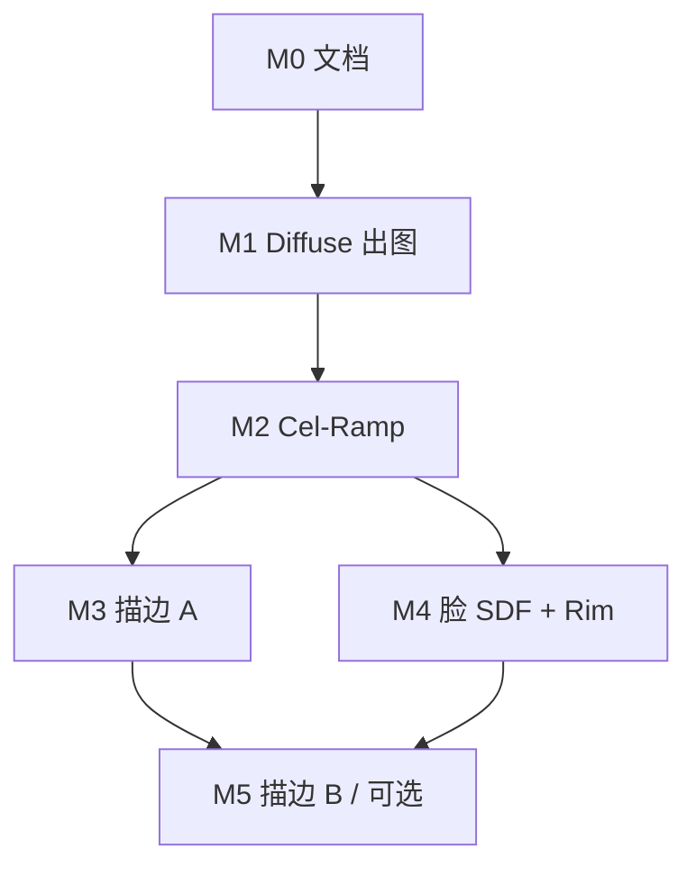

# 003_Toon_Shading 实施任务列表

> 本文是 [`003_Toon_Shading_Design.md`](003_Toon_Shading_Design.md) 的执行面：只承载「做什么、依赖谁、怎么验收」。设计论证回查设计文档。
>
> 用法：任务前的 `[ ]` / `[x]` 为进度标记。每个里程碑收尾后回写本文与设计文档 §5。

---

## 里程碑总览

| 里程碑 | 内容 | 状态 |
|---|---|---|
| M0 | 需求 / 任务文档 | 完成 |
| M1 | 工程骨架 + Diffuse 出图 | 完成 |
| M2 | Cel-Ramp | 未开始 |
| M3 | 描边 A（背面外扩） | 未开始 |
| M4 | 脸 SDF + Rim | 未开始 |
| M5 | 描边 B / 可选项 | 未开始 |

---

## M0 文档

- [x] **T0.1** 写 `Docs/003_Toon_Shading_Design.md`（目标 / 非目标 / 资产语义 / 架构 / 决策）
- [x] **T0.2** 写本文
- [x] **T0.3** `Docs/Todo/TODO_next_examples.md` 的 003 节改为摘要 + 指向上述两份文档

---

## M1 工程 + Diffuse 出图

- [x] **T1.1** 只拷 FBX + PNG 到 `Model/Nilou/`，不拷 `.meta` / `.mat`
- [x] **T1.2** 新建 `003_Toon_Shading`：vcxproj GUID `{A0DE0003-1B40-4E50-9D33-1AC9F00CE013}`，登记 `TitusGLRenderer.sln` 与根 `README.md`
- [x] **T1.3** `Tools/check_no_backend_headers.py` 默认扫描加入 `003_Toon_Shading` 并走 STRICT
- [x] **T1.4** `ModelLoadOptions` 增加 `preTransformVertices`（给其它静态 FBX）。本仓 Assimp 读妮露 FBX 会崩，M1 改为 `Tools/export_nilou_obj.py`（ufbx）烤 T-pose OBJ，运行时 `LoadModel(Nilou.obj)`
- [x] **T1.5** `NilouMaterials`：按网格名过滤（保留 Body / Dress / Hair / Face）；按材质名绑 Diffuse PNG 到 `TextureSlot::Diffuse` + `sharedImages`
- [x] **T1.6** `LoadModel(loadTextures=false)` 后手填贴图，再 `UploadGpuModel`；缺网格或缺贴图打错误日志
- [x] **T1.7** 打 AABB 日志；把角色缩放到约 1.8 单位高、脚底贴地；飞行相机对准正面
- [x] **T1.8** Forward 单 Pass + `DrawGpuModelWithDiffuse`；shader 采样 Diffuse + 方向光
- [x] **T1.9** 验收：GL / VK 都能认出是妮露；朝向 / 比例 / UV 正确（必要时关 `flipUVs`）

**风险**：

- 本仓 Assimp 无法读这套二进制 FBX（已用 ufbx→OBJ 绕过）。ufbx 的 Python 绑定在一个进程里连续访问多张网格会 ACCESS_VIOLATION，导出脚本因此每张网格开一个子进程。
- 加载时必须 `flipUVs=false`：OBJ 的 V 已是 OpenGL 约定，贴图只靠 `flipVerticallyOnLoad`（两者一起翻会采错图集，见 001）。
- 头部由 `Face` / `Face_Eye` / `Brow` 三张薄片拼成，缺一张就会在脸上留洞并透出头发。

---

## M2 Cel-Ramp

- [ ] **T2.1** 按材质绑 ilm（线性）+ Shadow Ramp（sRGB + Clamp）；Body/Dress 共用 Body Ramp，Hair 用 Hair Ramp
- [ ] **T2.2** shader：半 Lambert × ilm.g 采样 Ramp；ilm.a 选行
- [ ] **T2.3** ImGui：主光方向、Ramp 阈值（BrightFac / GreyFac / DarkFac）
- [ ] **T2.4** 验收：转动主光明暗分层跟着走；头发与身体 Ramp 行不同

---

## M3 描边 A — 背面外扩

- [ ] **T3.1** `MeshVertex` 增加 `Vec4 color`，Assimp 读 `mColors[0]`；同步 `AssetGpuUploader` 顶点布局
- [ ] **T3.2** 第二遍：`CullMode::Front`，沿法线外扩，宽度 × `vertexColor.a`
- [ ] **T3.3** Dress 使用更大的 outline z-offset；脸可先关描边
- [ ] **T3.4** 验收：轮廓不断、不炸线；裙子不穿进身体

---

## M4 脸 SDF + Rim

- [ ] **T4.1** Face 变体：SDF 采样 + 头朝向（T-pose 写死或取一次 Head 骨）
- [ ] **T4.2** Rim：`1 - N·V`，ImGui 调强度 / 宽度
- [ ] **T4.3** 验收：侧光时脸颊 SDF 分界清晰，不是鼻梁被 N·L 涂脏

---

## M5 描边 B 与可选项

- [ ] **T5.1** 描边 B：深度 + 法线 Sobel / Roberts，ScreenQuad 合成
- [ ] **T5.2**（可选）金属 Matcap / 头发 Emission
- [ ] **T5.3**（可选）Hatching
- [ ] **T5.4** 描边 C：不在本工程做；若要做，另开 `Docs/Todo/TODO_stencil_state.md` 补 `StencilOpState`

---

## 贯穿性约定

- 每个里程碑收尾产出 GL 与 VK 双后端截图，沿用 `--screenshot-at` / `--screenshot-dir`
- 业务目录禁止 include 后端头；过 `check_no_backend_headers` 与 `check_deps_direction`
- 决策变更时回写设计文档 §6
