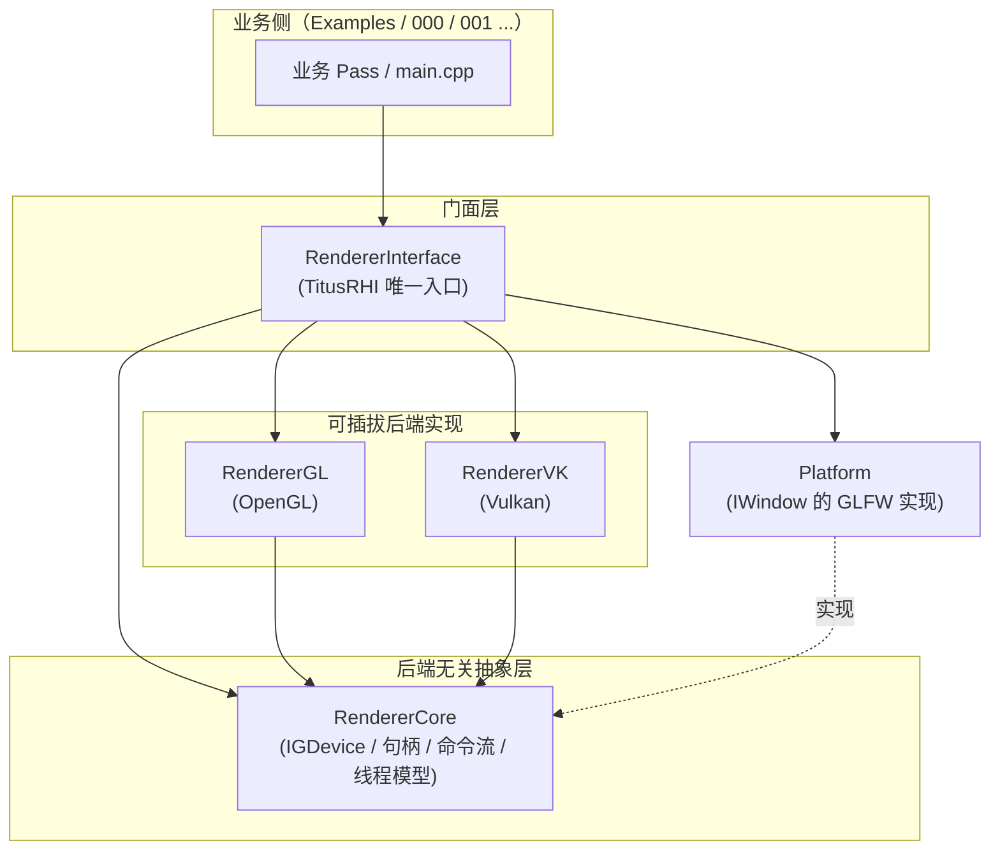
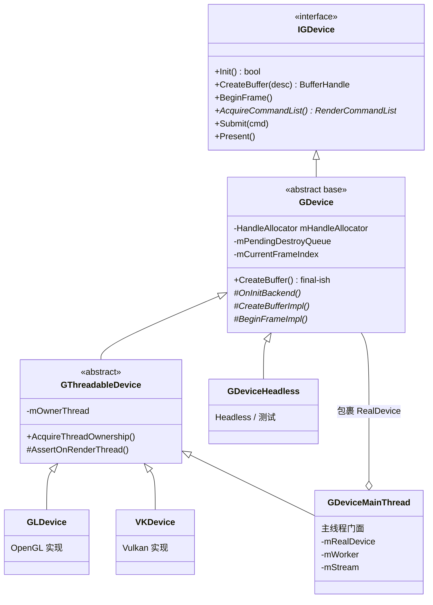

# 后端架构总览（第 1 遍：架构地图）

> 本文是《后端架构梳理》系列的第 1 篇，只讲 **Why + 分层 + 关键设计决策**，不下钻到具体文件/函数。
> 逐模块职责见第 2 篇，class/struct/函数细节见第 3 篇，动态时序见第 4 篇（见文末导航）。

---

## 1. 这套渲染层是什么

一套 **以 `GDevice` 为核心的、可插拔的多后端渲染架构**。核心理念：

- **上层只描述"做什么"，后端负责"怎么做"**：业务/示例只依赖后端无关的接口与句柄，完全不感知底层是 OpenGL 还是 Vulkan。
- **后端可插拔**：OpenGL 与 Vulkan 是两套并列的可替换实现，通过命令行 `--backend=gl|vk|null` 或 `APP::SetBackend(...)` 选择。
- **线程模型可插拔**：`--threading=direct|threaded|nonthreaded`；当前 **GL / VK 均默认 `Direct`**（`Threaded` 对 Compute / Descriptor / AS 尚未完全补齐，可用 `--threading=threaded` 回归）。

---

## 2. 分层与依赖拓扑



**依赖方向是单向的**，由 CI 脚本在构建期强制（见 §6）：

```
RendererInterface ──► { RendererGL, RendererVK, RendererCore, Platform } ──► RendererCore
```

- 只有 `RendererInterface/GDeviceFactory.cpp` 一个文件被允许**同时** include `RendererGL/GLDevice.h` 与 `RendererVK/VKDevice.h`，它是唯一的"后端分发点"。
- `RendererCore` 严禁 include 任何后端 SDK 头（`<vulkan/...>`、`<GL/...>`、`<glad/...>`、`<GLFW/glfw3.h>`）。

---

## 3. 各层职责与约束

| 层 | 目录 | 职责（做什么） | 硬约束（禁止碰什么） |
|---|---|---|---|
| **门面层 / Facade** | `RendererInterface/` | 对外**唯一**入口（`TitusRHI::APP/WINDOW_KEYWORD/CAMERA/...`）；后端与线程模式选择；把业务 Pass 挂到调度器 | 外部只能 include `RendererInterface/*.h`，不得直接 include `RendererCore/`、`RendererGL/`、`RendererVK/` |
| **抽象层 / Core** | `RendererCore/` | 定义"做什么"：`IGDevice` 接口、不透明句柄、资源/管线描述、命令列表、Pass 调度、线程模型（Client/Worker/StreamBuffer）、后端无关基类 `GDevice` | 严禁 include 任何后端 SDK 头；所有类型仅用自定义 Handle/Desc/Enum |
| **后端 - OpenGL** | `RendererGL/` | 用 OpenGL 实现 `GDevice` 的 `*Impl()` 钩子；命令列表翻译（`GLCommandList`）、GLSL 编译、FBO/纹理等资源创建 | 禁止 include `RendererVK/`、`RendererInterface/` |
| **后端 - Vulkan** | `RendererVK/` | 用 Vulkan 实现 `GDevice` 的 `*Impl()` 钩子；Instance/Device/Queue、交换链、Pipeline、命令缓冲、光追 | 禁止 include `RendererGL/`、`RendererInterface/` |
| **平台层** | `Platform/` | `IWindow` 抽象的 GLFW 实现 | 禁止 include `RendererGL/`、`RendererCore/`、`RendererVK/`、`RendererInterface/` |

---

## 4. 设备继承链（本架构的脊椎）

抽象层用一条清晰的继承链承载"通用逻辑下沉、后端差异上浮"：



- `IGDevice`（`RendererCore/IGDevice.h:24`）：**纯接口**，对外可见的最小契约。
- `GDevice`（`RendererCore/GDevice.h:66`）：**真正的后端无关基类**。用模板方法把"参数校验 + 句柄分配 + 延迟销毁 + 流程编排"下沉为非虚 API，子类只实现后端强相关的 `*Impl()` 钩子（如 `CreateBufferImpl`、`BeginFrameImpl`）。
- `GThreadableDevice`（`RendererCore/GThreadableDevice.h:22`）：叠加"渲染线程归属"能力（`AcquireThreadOwnership` / `AssertOnRenderThread`）。
- `GLDevice`（`RendererGL/GLDevice.h:89`）/ `VKDevice`（`RendererVK/VKDevice.h:155`）：两个并列后端实现，均继承 `GThreadableDevice`。
- `GDeviceMainThread`（`RendererCore/GDeviceMainThread.h:27`）：Threaded 模式下的**主线程门面**，内部**持有**一个真实设备并把帧控制命令甩到 Worker 线程执行（见 §5.3）。

---

## 5. 关键设计决策与权衡

### 5.1 不透明、类型安全的句柄
`GHandle<Tag>`（`RendererCore/GHandle.h:16`）内部只是一个 `uint64_t id`（POD），靠模板 `Tag` 做**编译期类型安全**：`BufferHandle` 与 `TextureHandle` 互相赋值会编译报错；约定 `id==0` 为非法句柄。
- **好处**：上层永不接触后端原生类型（`GLuint` / `VkBuffer`），后端可自由改变内部表示。

### 5.2 模板方法：`Create*` → `Create*Impl`
基类 `GDevice::CreateBuffer` 等完成"参数校验 + 从 `HandleAllocator` 分配 id + 登记后端无关元数据"，再调用子类的纯虚 `CreateBufferImpl(id, desc)` 把 id 与后端原生对象关联（`RendererCore/GDevice.h:101` 与 `:177`）。
- **好处**：句柄分配、生命周期、元数据登记只写一遍；后端子类零样板，只关心"怎么建"。

### 5.3 三种线程模型
枚举 `GThreadingMode`（`RendererCore/GThreadingMode.h:13`）：

| 模式 | 含义 | 默认用于 |
|---|---|---|
| `Direct` | 主线程直接驱动设备 | **GL / VK（当前默认）** |
| `NonThreaded` | 单线程录制 + 单线程提交，无 Worker | — |
| `Threaded` | 主线程门面 + Worker 工作线程 | 可选（`--threading=threaded`） |

`Threaded` 模式的实现（M2 最小可用版）：
- `GDeviceMainThread`（主线程）把 `BeginFrame/Submit/Present/WaitIdle` 序列化为 `GCommand` 写入 `CommandRingBuffer`（SPSC 字节流）；
- `GDeviceWorker`（`RendererCore/GDeviceWorker.h:46`）在工作线程消费命令并 dispatch 到真实设备；
- 资源类 API（`CreateBuffer/UpdateTexture/...`）暂时**持锁同步透传**到 RealDevice，未来（M3）再迁移到流式延迟创建。
- **当前默认不走 Threaded**：Worker 路径对 ComputePipeline / Dispatch / DescriptorSet / AS 尚未完全补齐，会在 Init 阶段踩空；故 `PickDefaultThreading` 对 GL/VK 均返回 `Direct`。用户仍可显式 `--threading=threaded` 做回归。

### 5.4 命令录制与执行分离
`IGDevice::AcquireCommandList()` 取本帧命令列表，业务侧向 `RenderCommandList` 录命令，再 `Submit(cmd)`（`RendererCore/IGDevice.h:93`）。多帧 In-Flight 的 Fence/Semaphore **完全封装在后端内部，不外泄**（`IGDevice.h:87` 注释）。

### 5.5 延迟销毁（Frames-in-Flight 安全）
`Destroy(handle)` 不立即释放，而是入 `mPendingDestroyQueue`，记录入队帧号；`Present()` 时对满足 `submitFrame + framesInFlight <= 当前帧` 的条目才真正调用 `Delete*Impl(id)`（`RendererCore/GDevice.h:230-240`）。`Shutdown()` 时强制 Flush 全部残留。
- **好处**：避免释放仍被 GPU 在用的资源。

### 5.6 状态对象去重缓存
`SamplerCache` / `PipelineCache`（`RendererCore/GDevice.h:268`）：`CreateSampler` / `CreatePipeline` 先按 desc 查缓存，命中则复用句柄，避免重复创建等价状态对象。

### 5.7 工厂桥接注入
`GDeviceFactory::Create`（`RendererInterface/GDeviceFactory.cpp:66`）：
- `CreateRealDevice` 按 `GBackend` `new` 出 `GLDevice/VKDevice/GDeviceHeadless`；
- 若线程模式为 `Threaded`，再外包一层 `GDeviceMainThread`（`:79`）。
- 后端 enable 由编译宏 `RENDERER_ENABLE_GL/VK` 控制，未启用时返回 `nullptr` 并报错。

---

## 6. 编译期强约束（防止抽象被穿透）

| 约束 | 脚本 / 机制 | 触发时机 |
|---|---|---|
| `RendererCore/` 与业务侧禁止 include 后端 SDK 头 | `Tools/check_no_backend_headers.py/.bat` | Examples PreBuild，命中即构建失败 |
| 依赖方向单向 | `Tools/check_deps_direction.bat` | `RendererInterface` PreBuildEvent |
| 宏一致性（血泪教训） | 见 [`2026-07-16_vk_odr_crash.md`](../Bug/2026-07-16_vk_odr_crash.md) | — |

> **ODR 陷阱**（[`2026-07-16_vk_odr_crash.md`](../Bug/2026-07-16_vk_odr_crash.md)）：`VKDevice` 里受 `RENDERER_ENABLE_RAY_TRACING` 控制的成员会改变 `sizeof`/成员偏移；若该宏在 `RendererInterface`（执行 `new VKDevice` 处）与 `RendererVK`（编译构造函数处）不一致，就会"按小尺寸分配、按大布局构造"→ 堆破坏 → 0xC0000005。**教训：任何用宏控制类布局的头文件，该宏必须在所有引用它的编译单元中一致**（建议抽到共享 `.props`）。这一条会在第 4 篇《设计陷阱》里详述。

---

## 7. 关键命名空间

| 命名空间 | 归属 | 用途 |
|---|---|---|
| `TitusRHI` | RendererCore | 后端无关抽象（句柄/枚举/描述/设备基类/线程模型） |
| `TitusRHIInterface` | RendererInterface | 门面层内部实现（工厂等） |
| `TitusGraphics` | RendererGL | OpenGL 后端实现（`GLDevice` 等） |
| `TitusVkGraphics` | RendererVK | Vulkan 后端实现（`VKDevice` 等） |

### 7.1 命名空间限定写法

1. **默认**：写 `TitusRHI::` / `TitusMath::` / `std::` 等，**不要**加前导全局作用域运算符 `::`（即写 `TitusRHI::IGDevice`，不写 `::TitusRHI::IGDevice`）。
2. **必须加前导 `::`**：仅在 `#define` 宏展开体中引用命名空间内符号时（如 `LOG_*`、`VK_CHECK` 使用 `::TitusBasic::Logger`），避免被调用点局部同名符号劫持；或存在真实名字查找冲突且加 `::` 为消歧所必需时（应旁注原因）。
3. **禁止**：在头文件作用域使用 `using namespace`；也不要为“风格统一”给 `std::` / `glm::` 加前导 `::`。
4. **`using`**：允许在 `.cpp` 函数作用域内 `using namespace TitusRHI;`；跨命名空间批量引入类型优先 `using TitusRHI::Format;`。
5. **范围**：本约定约束项目自有代码；`Third-Party` 不改；遗留 `002_*` 样例不强制同步。

---

## 8. 文档导航

| # | 文档 | 视角 | 状态 |
|---|---|---|---|
| 1 | `00_Overview.md`（本文） | 架构地图 / Why / 分层 / 设计决策 | ✅ |
| 2 | `10_RendererCore.md` / `20_RendererVK.md` / `30_RendererGL.md` / `40_Interface.md` | 逐模块职责 + 热点函数下钻 | ✅ |
| 2b | `21`–`24_VK_Step*.md` | VK 路径分步精读（启动帧 / Staging / Shader-Pipeline / Descriptor） | ✅ |
| 3 | （并入各模块文档的"细节"章节） | class/struct 字段/生命周期/行号引用 | ✅（随模块文档） |
| 4 | `90_Flows.md` / `99_Pitfalls.md` | 关键流程时序图 + 设计陷阱 | ✅ |
| — | `50_Tracy.md` | Tracy 构建开关 / on-demand / ImGui 运行时采集 / 插桩地图 | ✅ |

---

## 9. 建议阅读顺序

1. 先读本文建立分层与继承链的心智模型；
2. 再看 `10_RendererCore.md` 吃透抽象契约（句柄/描述/`GDevice` 模板方法）；
3. 然后任选一个后端（推荐 GL 更直观 → `30_RendererGL.md`，或 VK 更完整 → `20_RendererVK.md`）看"契约如何被实现"；
4. 深入 VK 时按 `21 → 22 → 23 → 24` 分步精读；
5. 用 `90_Flows.md` 把静态结构串成一帧的动态流程；门面 API / 截图见 `40_Interface.md`；
6. 做 CPU 帧路径分析时读 `50_Tracy.md`（编译 / 连接 / ImGui Capture 三层开关）。
