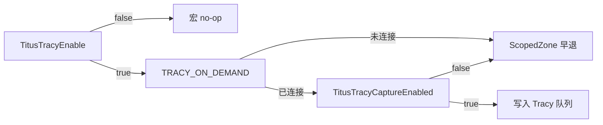

# Tracy 性能分析集成

> 说明本仓库如何接入 [Tracy](https://github.com/wolfpld/tracy)、三层开关语义、插桩约定与使用方式。
> 第三方源码在 `Third-Party/tracy/`；业务侧只通过 `Basic/TracySupport.h` 使用。

---

## 1. 三层开关（由外到内）

| 层 | 控制方式 | 关闭时的效果 |
|---|---|---|
| **编译期** | `TitusTracyEnable` → 宏 `TRACY_ENABLE` | 插桩宏为空操作，**近似零开销**（测真实帧率用此层） |
| **连接期** | `TRACY_ON_DEMAND`（随 Tracy 一并开启） | Profiler **未连接**时不往队列写事件，避免内存膨胀 |
| **运行时** | `TitusTracyCaptureEnabled` / ImGui「Tracy Capture」 | **已连接**仍可暂停；`ZoneScoped*` / `FrameMark` / `TracyPlot` 早退 |

三者同时满足（编译开 + 已连接 + Capture 勾选）才会持续采集。



---

## 2. 构建配置

**文件：** 仓库根 `Directory.Build.props`（MSBuild / VS 自动导入）

| 项 | 行为 |
|---|---|
| 默认 | **Debug = 开**，**Release = 关** |
| 开启时宏 | `TRACY_ENABLE` + `TRACY_ON_DEMAND` |
| 开启时调试格式 | `/Zi`（`ProgramDatabase`），避免 Edit and Continue `/ZI` 导致 `ZoneScoped` **C2131** |
| 链接 | `ws2_32.lib`、`dbghelp.lib` |
| Include | 所有配置都加入 `Third-Party\tracy\public`（无 `TRACY_ENABLE` 时头文件多为空实现） |

**命令行覆盖：**

```text
msbuild ... /p:TitusTracyEnable=false   # Debug 下关掉 Tracy
msbuild ... /p:TitusTracyEnable=true    # Release 下打开 Tracy
```

改宏后需**大范围/全量重编**（预处理宏不一致会导致行为混乱）。

**Client 编译点：** 仅 `Basic/Basic.vcxproj` 编译一份  
`Third-Party/tracy/public/TracyClient.cpp`（全进程单实例）。

本地捕获产物放在 `/Profiler/`（已 `.gitignore`，不入库）。

---

## 3. 入口与运行时 API

| 文件 | 职责 |
|---|---|
| `Basic/TracySupport.h` | 唯一推荐 include；包装常用宏；声明运行时 API |
| `Basic/TracySupport.cpp` | `std::atomic<bool>` 实现；默认 **Capture = true** |

```cpp
bool TitusTracyCaptureEnabled();
void TitusTracySetCaptureEnabled(bool enabled);
```

在 `TRACY_ENABLE` 下，头文件会 `#undef` 后重定义：

- `ZoneScoped` / `ZoneScopedN` / `C` / `NC` / `S` / `NS` / `CS` / `NCS`
- `FrameMark` / `FrameMarkNamed` / `FrameMarkStart` / `FrameMarkEnd`
- `TracyPlot` / `TracyPlotConfig`

使其 `active` / 写入路径受 `TitusTracyCaptureEnabled()` 约束。

**调用约定：**

1. 只 `#include "TracySupport.h"`，不要直接 include `tracy/Tracy.hpp`。
2. `ZoneTransient*` / `ZoneNamed*(..., active)` 的 `active` 参数请传 `TitusTracyCaptureEnabled()`（见 `PassScheduler.cpp`）。
3. `tracy::SetThreadName`、`TracyIsConnected` 等未包装，按 Tracy 原生使用即可。

---

## 4. ImGui 控制

**位置：** `RendererInterface/TitusGfxOverlay.cpp` →「Renderer Info」面板。

- `TRACY_ENABLE`：Checkbox **Tracy Capture** + `(connected)` / `(not connected)`（`TracyIsConnected`）。
- 未编译 Tracy：灰字 `Tracy: build disabled`。

若业务自定义了 `IMGUI::SetUserCallback` 且未调用 `OVERLAY::Render()`，默认面板（含此开关）不会出现，需自行接 UI 或在回调里调用 `OVERLAY::Render()`。

---

## 5. 插桩地图（当前）

| 区域 | 文件 | 内容 |
|---|---|---|
| 应用帧 | `RendererInterface/TitusGfx.cpp` | `APP::UpdateApp`、`IMGUI::NewFrame`；帧末 **`FrameMark`** |
| Pass 调度 | `RendererCore/PassScheduler.cpp` | `DrawFrame` 阶段 Zone；Pass 循环 `ZoneTransientN`（`Pass:*` / `Update:*` / `Record:*`） |
| 设备门面 | `RendererCore/GDevice.cpp` | `BeginFrame` / `AcquireCommandList` / `Submit` / `Present` |
| Threaded | `GDeviceMainThread.cpp` / `GDeviceWorker.cpp` | 主线程阶段 Zone；Worker `SetThreadName("GDeviceWorker")` |
| Vulkan | `RendererVK/VKDevice.cpp` | `WaitInFlightFence`、`AcquireNextImage` |
| VK 描述符 | `RendererVK/VKCommandList.cpp` | 帧末 Plot：`VK DS BindCalls` / `Allocs` / `CacheHits`（**不在** Bind 热路径打 Zone） |
| 业务示例 | `000_Deferred_Shading/*` | GBuffer / Lighting 关键路径 |
| 通用绘制 | `RendererInterface/TitusGfxPass.h` | `DrawGpuModelWithDiffuse` |

新增插桩时：优先固定字面量 zone 名（便于 Tracy 聚合）；热路径高频调用点慎打 Zone，可考虑 Plot 或采样。

---

## 6. 推荐使用流程

1. Debug 构建（默认已开 Tracy），运行示例。
2. 启动 Tracy Profiler，**Connect** 到进程（on-demand 从此刻开始记）。
3. 需要对比「关采集帧率」时：在 ImGui 取消 **Tracy Capture**（不断开连接）。
4. 需要接近无插桩基线：Release，或 `/p:TitusTracyEnable=false` 后全量重编。

---

## 7. 注意点与陷阱

1. **Capture 关闭 ≠ 编译剥离**：仍有 atomic 读取与 `ScopedZone` 构造早退；测「真实帧率」请关 `TitusTracyEnable`。
2. **MSVC `/ZI`**：开启 Tracy 时 props 已强制 `/Zi`；若仍 C2131，可在 include 前 `#define TracyLine 0`。
3. **直接传 `active=true` 的 Zone**：会绕过 ImGui Capture（`ZoneTransient*` 等）；应传 `TitusTracyCaptureEnabled()`。
4. **ODR / 宏一致**：`TRACY_ENABLE` 由根 props 统一注入；勿在个别工程单独改定义导致混链。

相关陷阱条目见 `99_Pitfalls.md`（Tracy 小节）。
