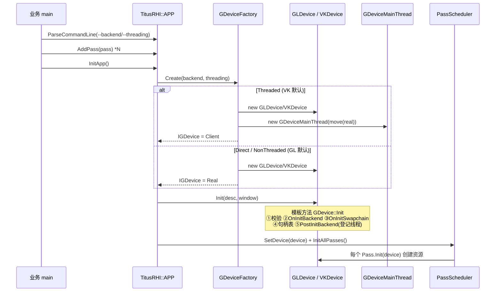
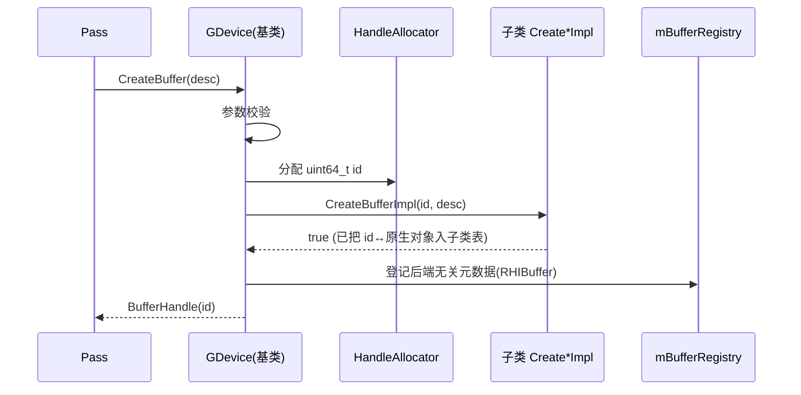
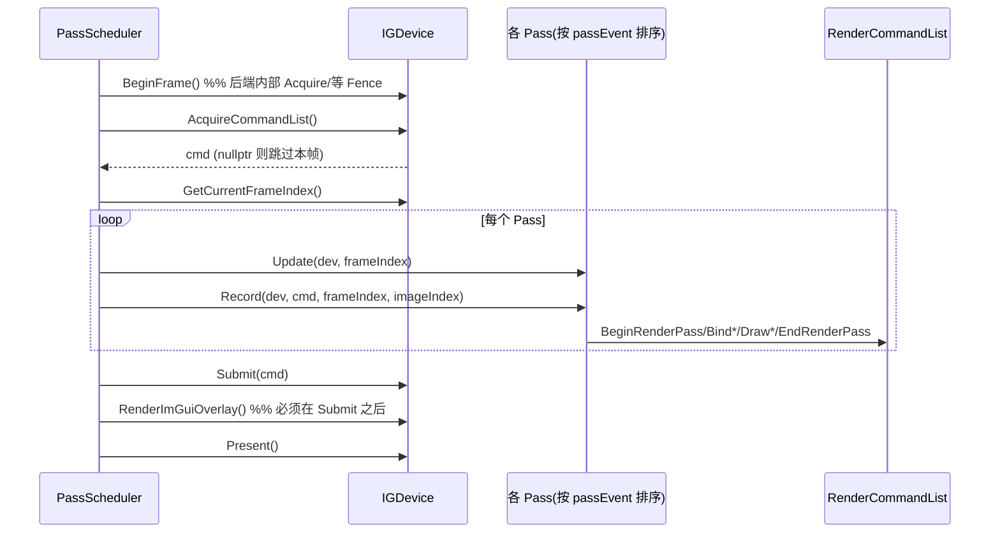
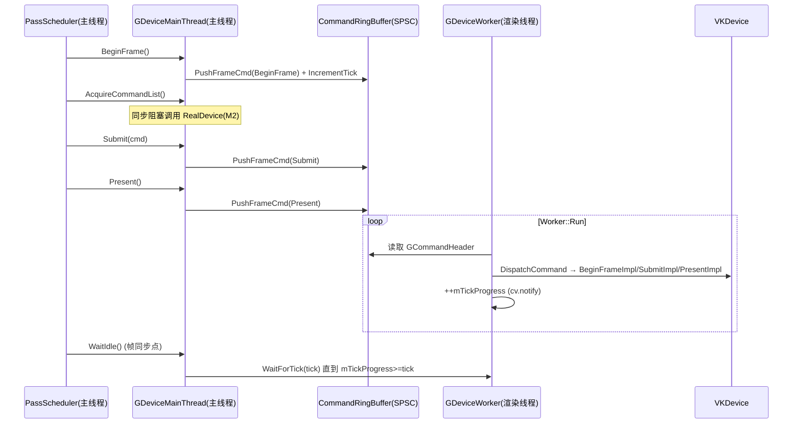
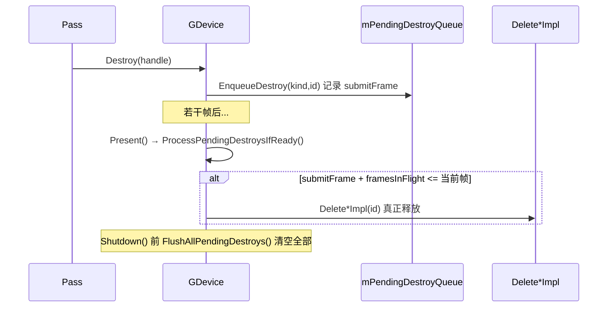

# 关键流程时序（第 4 遍）

> 把前几篇的静态结构串成动态流程。所有流程均基于代码实读（`PassScheduler.cpp`、`GDevice.cpp`、`GDeviceMainThread/Worker`、`GLDevice.cpp`、`VKDevice`/`README`）。
> 建议配合 `10_RendererCore.md` / `20_RendererVK.md` / `30_RendererGL.md` 对照阅读。

---

## 1. 启动装配（Backend + Threading 选择）

要点：
- `Threaded` 模式下 `IGDevice` 实际是 `GDeviceMainThread`，它内部持有真实设备并在需要时启动 `GDeviceWorker`。
- `GDevice::Init` 是**模板方法**（`GDevice.h:84`），固定 5 步顺序，任意步失败回滚。

---

## 2. 资源创建（模板方法 + 句柄分配）

- 基类只写一遍"校验 + 分配 + 登记"；子类只关心"怎么建"（`GDevice.h:101/177`）。
- `CreateSampler/CreatePipeline` 先查 `SamplerCache/PipelineCache` 去重（`GStateCache.h`）。

---

## 3. 一帧渲染（统一入口 `PassScheduler::DrawFrame`）

两后端**流程一致**（`PassScheduler.cpp:47`），差异全在设备 `*Impl()` 内部：

> `RenderImGuiOverlay` 在 `Submit` **之后**调用是硬约束（`PassScheduler.cpp:74-84`），原因见 `99_Pitfalls.md §2`。

---

## 4. GL（Direct）与 VK（Threaded）在 `*Impl()` 层的差异

| 步骤 | GL（Direct，主线程） | VK（Threaded，Worker 线程） |
|---|---|---|
| `BeginFrame` | `GLCommandList::Reset()` 清延迟队列（`GLDevice.cpp:696`） | `vkWaitForFences` + `vkAcquireNextImageKHR` |
| `AcquireCommandList` | 返回复用的 `mCommandList`（`:701`） | 返回绑定 primary cmdbuf 的 `VKCommandList` |
| Pass 录制 | 每条命令封成 `std::function` **入队**（不立即调 GL） | 直接 `vkCmd*` 录进 command buffer |
| `Submit` | `GLCommandList::Replay()` 主线程**回放**全部 lambda（`:706`） | 录 imgui→`primaryCmd->End()`→`vkQueueSubmit` |
| `Present` | 空（`SwapBuffers` 由 IWindow 做，`:711`） | `vkQueuePresentKHR`；out-of-date 触发重建 |

---

## 5. Threaded 模式的命令跨线程流

`Threaded` 下帧控制经 `GDeviceMainThread` → `CommandRingBuffer` → `GDeviceWorker` → 真实设备：

要点：
- **资源类 API**（`Create*/Update*/Destroy`）在 M2 阶段仍由 `GDeviceMainThread` **持 `mResourceMutex` 锁同步透传** RealDevice，不走 Stream（`GDeviceMainThread.h:48-73/151`）。
- 只有帧控制四件事走 Stream，让 `vkQueueSubmit/Present` 脱离主线程。
- `WaitForTick`（`GDeviceWorker.h:65`）是主线程等待 Worker 消费完成的帧同步点。

---

## 6. 延迟销毁（Frames-in-Flight 安全释放）

避免释放仍被 GPU 在用的资源（`GDevice.h:230-240`）。

---

## 7. 关闭

`APP::ShutdownApp` → `WaitIdle()`（VK: `vkDeviceWaitIdle` / GL: `glFinish`）→ `PassScheduler::DestroyAllPasses`（逐 Pass.Destroy）→ `device->Shutdown()`（模板方法：`FlushAllPendingDestroys` → `OnShutdownSwapchain` → `OnShutdownBackend`）。Threaded 模式下 `GDeviceMainThread` 析构会 `Worker::Stop()`（写 Stop 命令并 join）。
