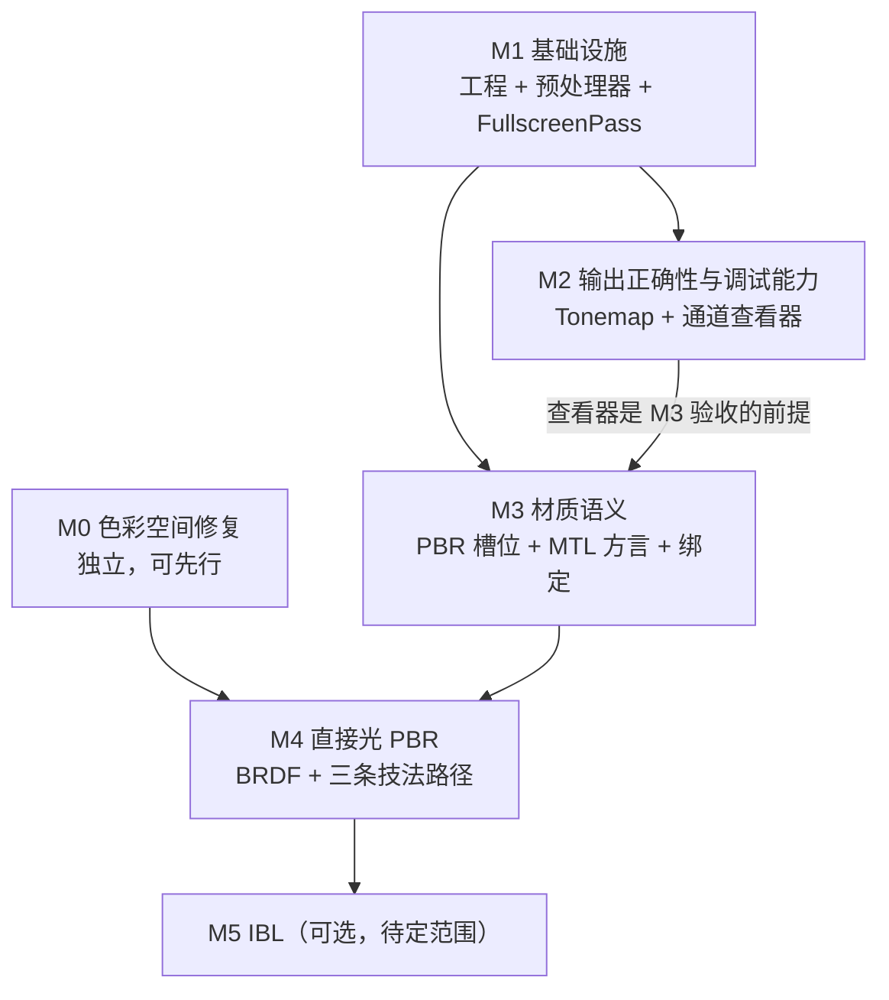

# RendererShading + PBR 实施任务列表

> 本文是 [`RendererShading_PBR_Design.md`](RendererShading_PBR_Design.md) 的执行面：只承载"做什么、依赖谁、怎么验收"，设计论证与权衡不在此重复，需要理由时回查设计文档对应章节。
>
> 用法：任务前的 `[ ]` / `[x]` 为进度标记。每个里程碑收尾后回写本文与设计文档 §7。

---

## 里程碑总览

| 里程碑 | 内容 | 对应设计文档 | 状态 |
|---|---|---|---|
| M0 | 色彩空间链路核查 | §2.2(1) | 已完成（结论：无需改动） |
| M1 | 基础设施（工程 / 预处理器 / FullscreenPass） | §3.3-3.4、§4.1、§4.6 | 未开始 |
| M2 | 输出正确性与调试能力（Tonemap / 查看器） | §4.4、§5.1 | 未开始 |
| M3 | 材质语义（PBR 槽位 / MTL 方言 / 绑定） | §4.3 | 未开始 |
| M4 | 直接光 PBR | §4.2、§4.5 | 未开始 |
| M5 | IBL（可选，范围待定） | §4.7 | 未开始 |

### 与设计文档 §5 的一处顺序修正

设计文档把 `TonemapPass` 排在阶段 0，但它依赖阶段 1 的 `FullscreenPass`，文档留了"先内联或与阶段 1 合并"两个选项未定。本文按下面方式解开，**每个里程碑内部不再有循环依赖**：

- 色彩空间修复单独抽成 M0——它不依赖任何新基础设施，可立即做且立刻见效
- tonemap 后移到 M2，作为 `FullscreenPass` 的**第一个子类**，顺带验证 M1 的基类设计
- 其余映射：设计文档阶段 1 = M1、阶段 2 = M3、阶段 3 = M4、阶段 4 = M5

### 依赖关系

---

## M0 色彩空间链路核查 —— 已完成，结论是无需改动代码

- [x] **T0.1** 核查 `RendererCore/AssetGpuUploader.cpp` 的 sRGB 解码链路。**结论：现有实现已正确，原计划的修改不必要。**

  设计文档最初依据 `PickFormat` 的 `case 3: return Format::R8G8B8_UNORM;`（`:66-68`）判断 3 通道 albedo 会以 UNORM 上传。追调用链后发现该分支对 UNorm8 **不可达**：
  - `PickFormat` 全项目仅一个调用点 `:248`，入参是 `*effectiveImage`
  - `:195-244` 的扩通道逻辑已在此之前把 `channels==3` 且 UNorm8/Float32 的图扩成 4 通道，`expanded = image` 浅复制保留 `colorSpace`
  - 于是实际走 `case 4` 的 `srgb ? R8G8B8A8_SRGB : R8G8B8A8_UNORM`，解码正确
  - 另有 `ImageLoader.cpp:36-48` 的 `opts.desiredChannels` 路径，上层传 4 时 stb 直接输出 4 通道，同样正确

- [x] **T0.2** 验收方式随之变更：无代码改动，故无需截图对比。设计文档 §2.2(1)、§4.4、§8 已同步修正。

**核查中发现的两个次要问题，均不影响 PBR 正确性，本轮不处理**：

- `PickFormat` 压缩纹理分支（`:32-36`）无条件返回 `R8G8B8A8_UNORM`，忽略 `srgb`。当前资产走 TGA 不走 DDS，未触发；注释已说明是已知简化
- 扩通道在 host 侧做全图拷贝，3 通道贴图有 33% 额外内存与一次遍历开销。属性能问题

**仍然存在的色彩空间真问题**在 M3 的 T3.2：`MeshLoader.cpp:26-35` 把 `aiTextureType_AMBIENT` 标为 `isSRGB=true`，而 sponza_pbr 的 `map_Ka` 实际是 metallic，会被错误地按 sRGB 解码。那是 MTL 方言问题，不是 `PickFormat` 问题。

---

## M1 基础设施

- [ ] **T1.1** 新建 `RendererShading` 工程骨架：静态库，比照 `RendererCore.vcxproj`（工具集用 `$(DefaultPlatformToolset)`，第三方路径走根 `Directory.Build.props` 变量）+ `TitusGLRenderer.sln` 条目与配置映射 + `RendererInterface/TitusGfxShading.h` 转发头。此步只要求空壳能编译链接通过
- [ ] **T1.2** CI 规则：`Tools/check_deps_direction.bat`（`:28-33`）增 `RendererShading` 扫描行并给 Core 追加 `RendererShading/` 禁止项；`Tools/check_no_backend_headers.py` 扫描范围纳入新目录
- [ ] **T1.3** `RendererCore/ShaderPreprocessor.h/.cpp`：`#include` 递归展开、循环包含检测、深度上限、`defines` 注入（插在 `#version` 之后）、**`#line` 指令注入**
- [ ] **T1.4** 预处理器单测：嵌套 include、循环包含报错、重复 include 去重（`#pragma once` 语义）、`#line` 行号与原始文件一致
- [ ] **T1.5** **【阻塞性决策】** 确定并落地 VK 源码路径：选项 A 改 `RendererCore/ShaderAsset.cpp` 让 VK 优先读 GLSL 交 glslang 在线编译；选项 B 扩展 `Tools/compile_shader.py` 做构建期展开与预编译。详见设计文档 §4.1
- [ ] **T1.6** `ShaderAsset` 接入预处理（`ShaderAsset.cpp:32-60` 之间，读字节与 `CreateShader` 之间）。依赖 T1.5
- [ ] **T1.7** `RendererShading/ShaderLibrary.h/.cpp`：`(path, defines)` 为键的变体缓存、shader 生命周期统一管理、按依赖文件 mtime 的热重载钩子
- [ ] **T1.8** `RendererShading/FullscreenPass.h/.cpp` + `Shaders/Fullscreen.glsl`：默认状态为无深度、无剔除、`TriangleList`；`Record` 走 `Draw(3)`；子类只需给 FS 路径 + `BindInputs` + 可选的 `ConfigurePipeline`
- [ ] **T1.9** 改造四条现有全屏路径接入基类：`000/DeferredLightingPass.cpp:232`、`000/ForwardPlusPass.cpp:910`、`001/ScreenQuadPass.cpp:176`、`002/WeightedBlendedOITPass.cpp:452`
- [ ] **T1.10** 删除四个冗余 VS：`000/Shader/DeferredLighting_VS.glsl`、`000/Shader/ForwardPlusResolve_VS.glsl`、`001/Shader/ScreenQuad_VS.glsl`、`002/Shader/WBOIT_Blend_VS.glsl`
- [ ] **T1.11** 验收：四条路径 GL / VK 双后端画面与改造前逐像素等价（或差异可解释）；三个 CI 脚本全绿

**注**：`ScreenQuadPass.cpp:54-101` 那 47 行"拼路径 → 读文件 → 2×ShaderDesc → CreateShader → PipelineDesc → CreatePipeline → 缺失兜底"是每个 Pass 都有一份的样板，T1.7 + T1.8 的目标就是让它归零。

---

## M2 输出正确性与调试能力

- [ ] **T2.1** `Shaders/ColorSpace.glsl` + `Shaders/Tonemap.glsl`：sRGB 互转、ACES 近似与 Reinhard 两个算子
- [ ] **T2.2** `RendererShading/TonemapPass.h/.cpp`，`passEvent = PostProcess`，作为 `FullscreenPass` 首个子类
- [ ] **T2.3** `000` 输出链路改为渲进 HDR RT（`R16G16B16A16_SFLOAT`）再经 tonemap 到 backbuffer；曝光与算子选择接 ImGui
- [ ] **T2.4** 纹理通道查看器（`FullscreenPass` 特例）：任选 RT 或贴图显示，支持通道隔离、数值范围映射、gamma 开关
- [ ] **T2.5** 验收：HDR 强光下不再直接过曝；查看器能正确显示单通道灰度

**注**：`GEnums.h` 无 `R11G11B10_UFLOAT`，HDR RT 用 `R16G16B16A16_SFLOAT`（`002/WeightedBlendedOITPass.cpp:68` 已在用）。若后续要加 R11G11B10，需同步改 `GEnums.h` + `GLTranslate.cpp` + VK 翻译表三处。

**T2.4 不是可选项**：M3 的验收需要单独查看 metallic / roughness 通道，靠肉眼看合成结果无法判断采样是否正确。

---

## M3 材质语义

- [ ] **T3.1** `AssetLoader/AssetTypes.h` 的 `TextureSlot` 增 `OpacityMask` / `Occlusion`，并同步 `RendererCore/MaterialInstance.h:26-37`（两者要求顺序与个数逐项对齐）
- [ ] **T3.2** `AssetLoader/ModelLoader.h` 的 `LoadOptions` 增 `MtlDialect` 枚举；`AssetLoader/MeshLoader.cpp:26-35` 按方言分表映射。`Max3dsPbr` 下：`AMBIENT → Metallic(linear)`、`OPACITY → OpacityMask`、`SHININESS → Roughness`（后者本来就对）
- [ ] **T3.3** `RendererShading/PbrMaterial.h` 的 `PbrMaterialUBO`（std140, 48B）+ `Shaders/PBRMaterial.glsl`（采样与解包，贴图存在性走 uint bitmask 而非变体宏，理由见设计文档 §4.1）
- [ ] **T3.4** `DrawGpuModelWithPbr` 加到 `RendererInterface/TitusGfxPass.h`：比照 `:105-108` 的 diffuse 版本，一次绑定 baseColor / normal / metallic / roughness / occlusion / emissive 六槽，沿用"连续相同材质跳过 `BindResourceSet`"的优化
- [ ] **T3.5** **【高风险前置】** 先用最小场景（单模型 + 6 张纯色贴图）验证 6 个 sampler 在 GL / VK 双后端的 set/binding 映射正确，重点检查 `ShaderReflector` 的 GLSL 正则回退路径。**此项通过后才做 T3.6**
- [ ] **T3.6** 加载 `Model/SponzaPBR_dds2tga/SponzaPBR.obj`（现有 demo 加载的是非 PBR 的 `Model/sponza/sponza.obj`），用 T2.4 的查看器逐通道确认采样与色彩空间正确
- [ ] **T3.7** 验收：四个通道在 GL / VK 下均正确，且 metallic 不再被当作 sRGB

**T3.2 背景**：`sponza_pbr.mtl` 用 3ds Max 方言（`map_Ka`=metallic、`map_Ns`=roughness、`map_d`=mask），而非标准 `map_Pm`/`map_Pr`/`norm`。当前 Assimp 通用映射把 metallic 贴图既放错槽位又标成 sRGB。**用显式枚举而非启发式猜测**，`Model/` 内资产逐个标注。

---

## M4 直接光 PBR

- [ ] **T4.1** `Shaders/BRDF.glsl`（GGX 分布、Smith 遮蔽、Schlick Fresnel）+ `Shaders/Lighting.glsl`（点光 / 方向光衰减与累加）
- [ ] **T4.2** `RendererShading/LightTypes.h`：`PointLight` / `DirectionalLight` + std140 GPU 镜像 + `FillPointLightBlock`，替代 `000/TechniqueContext.h:62-73`。**只下沉数据与布局，不下沉剔除策略**（设计文档 §3.6a）
- [ ] **T4.3** `000` 的 **Forward** 路径接 PBR，作为首个验证点
- [ ] **T4.4** GBuffer alpha 打包（零新增 RT）：`RT0.rgb=albedo, RT0.a=metallic`；`RT1.rgb=normal, RT1.a=roughness`；`RT2.rgb=position, RT2.a=occlusion`；Deferred 路径接 PBR
- [ ] **T4.5** Forward+ 路径接 PBR
- [ ] **T4.6** 验收：三条技法在相同光照下画面一致（这是本项目现有的核心对比价值）；金属与介电材质表现符合预期；GL / VK 双后端截图对比

**范围约定**：本里程碑只改 `000`。`001` 的 RSM 与 `002` 的 WBOIT 在其后单独处理；`002` 的透明路径按惯例只算 diffuse + 简化 spec，不接完整 BRDF。

---

## M5 IBL（可选，范围待定）

- [ ] **T5.1** HDR 环境图加载与 cubemap 上传链路验证（`ImageLoader.cpp:124` 的 float 路径 + `AssetGpuUploader.cpp:247-271` 的六面上传）
- [ ] **T5.2** Irradiance cube 预计算：32² × 6，`R16G16B16A16_SFLOAT`，余弦卷积
- [ ] **T5.3** Prefiltered env cube：128² × 6，mip 0..4，GGX 重要性采样 + `Shaders/Sampling.glsl`
- [ ] **T5.4** BRDF LUT：512²，`R16G16_SFLOAT`，compute 一次性生成
- [ ] **T5.5** 环境光项接入 shading；预计算 Pass 挂 `ERenderPassEvent::BeforeRendering` 且仅首帧执行
- [ ] **T5.6** 验收：关闭直接光后仅环境光画面合理；金属球粗糙度序列表现正确

**可行性已确认**：cubemap（`GDescs.h:78-84` 的 `TextureType::TexCube`）、mip 自动计算（`mipLevels=0`）、HDR 加载、compute pipeline 均已具备，**无需扩 RHI**。

---

## 关键决策点

| 决策 | 阻塞 | 状态 |
|---|---|---|
| VK 源码路径：选项 A（GLSL 在线编译，推荐）/ B（构建期预编译） | T1.6，需在 M1 开工前定 | **待定** |
| M5 是否纳入本轮 | M5 全部 | **待定** |
| `000`/`001` 重复场景类如何处理（按 §3.6b 不进本层） | 无（独立问题） | 待定 |
| §4.8 资源连接改进是否纳入 | 无（独立问题） | 待定 |
| 两个未跟踪旧 demo：迁移还是删除 | 无 | 待定 |

---

## 贯穿性约定

- 每个里程碑收尾产出 GL 与 VK 双后端截图并留档，沿用现有 `--screenshot-at` / `--screenshot-dir` 机制
- 决策变更时回写设计文档 §7，保持两份文档一致
- 新增到 `RendererShading` 的每个文件，对照设计文档 §3.5 的双判据（着色语义 + 两次重复）自查一次
- Threaded 线程模式不纳入任何里程碑的验收（当前 GL / VK 默认均为 `Direct`，且该路径对 Compute / Descriptor / AS 尚未补齐）
