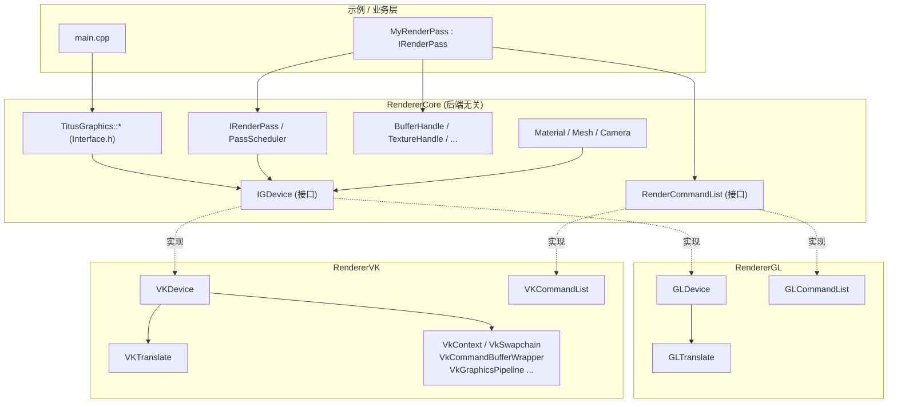

# 通用渲染管理层（GDevice 抽象层）设计方案

> ✅ **设计已落地（历史方案文档）**：本文是当初提出"后端无关 GDevice 抽象层"的设计方案。
> 该方案现已实现——`RendererCore`（`IGDevice`/句柄/`RenderCommandList`/`IRenderPass`/
> `PassScheduler`）+ `RendererGL`/`RendererVK`（设备实现）+ `RendererInterface`（门面/工厂）。
> 文中 §1"现状分析"引用的旧文件（`Interface.h`/`VkInterface.h`/`IRenderPass`/`IVkRenderPass`/
> `RenderCommandBuffer`/`ShaderProgram`/`VkGraphicsPipeline` 等）是**当时的起点现状**，均已随
> 旧路径清退删除。当前落地结构以 `Docs/Architecture/00_Overview.md` 为准；本文保留作为设计动机与决策记录。

> 设计参考：后端无关设备抽象层 + 平台子目录（vulkan / d3d12 / metal / opengl 等）模式。  
> 目标：**让上层业务（Pass、相机、Mesh、UI、ImGui …）与具体图形 API 解耦**，编译期或运行期可在 GL / VK 之间切换。

---

## 1. 现状分析：为什么"上层会感知后端"

把两边的对外 API 摆在一起就能看到泄漏点：

| 关注点 | OpenGL 侧 | Vulkan 侧 | 问题 |
|---|---|---|---|
| 命名空间 | `TitusGraphics::*`（[Interface.h](../Renderer/Interface.h)） | `TitusVkGraphics::*`（[VkInterface.h](../RendererVK/VkInterface.h)） | 业务 include 不同头、调不同函数。 |
| Pass 基类 | `IRenderPass` | `IVkRenderPass` | 业务一旦继承就和后端绑死。 |
| 命令缓冲 | `RenderCommandBuffer`（`std::function` 延迟队列） | `VkCommandBufferWrapper`（真实 GPU 指令） | 语义不同，签名也不同。 |
| Pipeline / Shader | `ShaderProgram` + GL 状态机 | `VkGraphicsPipeline`（PSO 不可变） | 一边可零散改状态，一边必须事先打包。 |
| 资源句柄 | `GLuint` 直接暴露 | `VkBuffer`/`VkImage`/`VkDeviceMemory` 直接暴露 | 上层代码要 include GL/VK 头。 |

任何模块只要碰到上述 5 项里的一个，就被绑到具体后端，所以这 5 项就是**抽象层必须吃掉的边界**。

---

## 2. 顶层架构

```
┌────────────────────────────────────────────────────────┐
│            应用 / 示例工程  (010_Triangle)              │
│  只 include  RendererCore/*.h， 不感知 GL / VK          │
└────────────────────────────────────────────────────────┘
                      │  IRenderPass / Material / Mesh / CommandBuffer
                      ▼
┌────────────────────────────────────────────────────────┐
│   RendererCore  (后端无关层 = 我们要新增的层)            │
│   • IGDevice 抽象接口                                  │
│   • GHandle<T>（不透明句柄，PoD）                      │
│   • GEnums / GDescs（Format / Topology / Blend …）   │
│   • CommandBuffer（录制接口，不是真 VkCmdBuffer）        │
│   • IRenderPass / PassScheduler / ResourceManager       │
│   • Material / Shader / Mesh / Texture / UBO 高层封装   │
└────────────────────────────────────────────────────────┘
        │ 工厂 (GDeviceFactory::Create)        │ 编译宏 / 运行期开关
        ▼                                        ▼
┌──────────────────────┐               ┌──────────────────────┐
│  RendererGL  (后端)  │               │  RendererVK  (后端)  │
│  实现 IGDevice     │               │  实现 IGDevice     │
│  把 Handle ↔ GLuint  │               │  把 Handle ↔ VkXxx   │
└──────────────────────┘               └──────────────────────┘
```

关键约定：

1. **上层只依赖 `RendererCore`**。`RendererGL` / `RendererVK` 是它的"插件"，运行期注入。
2. 所有 GPU 资源在上层都是 `BufferHandle / TextureHandle / ShaderHandle / PipelineHandle / SamplerHandle`，**只是一个 `uint64_t`**（不透明句柄）。
3. 命令录制走 `RenderCommandList`（抽象），后端各自把它翻译成 `glXxx` 或 `vkCmdXxx`。
4. 后端自己内部仍然可以保留 `RendererGL/`、`RendererVK/` 的细分模块（Swapchain、CommandPool、同步对象等）。

---

## 3. 抽象层最小核心（按落地优先级排序）

### 3.1 `GHandle<TagT>` —— 不透明资源句柄（**第一步要做**）

```cpp
// RendererCore/GHandle.h
template<typename Tag>
struct GHandle {
    uint64_t id = 0;
    bool IsValid() const { return id != 0; }
    bool operator==(GHandle o) const { return id == o.id; }
};
struct BufferTag{};   using BufferHandle   = GHandle<BufferTag>;
struct TextureTag{};  using TextureHandle  = GHandle<TextureTag>;
struct SamplerTag{};  using SamplerHandle  = GHandle<SamplerTag>;
struct ShaderTag{};   using ShaderHandle   = GHandle<ShaderTag>;
struct PipelineTag{}; using PipelineHandle = GHandle<PipelineTag>;
struct RenderTargetTag{}; using RenderTargetHandle = GHandle<RenderTargetTag>;
```

后端内部用 `std::unordered_map<uint64_t, GLuint>` 或 `std::unordered_map<uint64_t, VKResource>` 反查实际对象。**上层永远不 include `gl.h` / `vulkan.h`**。

### 3.2 `IGDevice` —— 设备接口

```cpp
// RendererCore/IGDevice.h
class IGDevice {
public:
    virtual ~IGDevice() = default;

    // —— 生命周期 ——
    virtual bool Init(const GDeviceDesc& desc, IWindow* win) = 0;
    virtual void Shutdown() = 0;
    virtual void WaitIdle() = 0;

    // —— 资源创建 / 销毁（同步即可，先不做异步） ——
    virtual BufferHandle   CreateBuffer  (const BufferDesc&)        = 0;
    virtual TextureHandle  CreateTexture (const TextureDesc&)       = 0;
    virtual SamplerHandle  CreateSampler (const SamplerDesc&)       = 0;
    virtual ShaderHandle   CreateShader  (const ShaderDesc&)        = 0;
    virtual PipelineHandle CreatePipeline(const GraphicsPipelineDesc&) = 0;
    virtual RenderTargetHandle CreateRenderTarget(const RenderTargetDesc&) = 0;

    virtual void Destroy(BufferHandle)   = 0;
    virtual void Destroy(TextureHandle)  = 0;
    /* ...其他 Destroy 重载... */

    // —— 数据上传 ——
    virtual void UpdateBuffer (BufferHandle, const void* src, size_t bytes, size_t offset = 0) = 0;
    virtual void UpdateTexture(TextureHandle, const TextureUploadDesc&) = 0;

    // —— 帧 / 录制 ——
    virtual void           BeginFrame() = 0;
    virtual RenderCommandList* AcquireCommandList() = 0;       // 上层向其录命令
    virtual void           Submit(RenderCommandList*) = 0;
    virtual void           Present() = 0;

    // —— 能力查询 ——
    virtual const GCaps& GetCaps() const = 0;
    virtual GBackend     GetBackend() const = 0;             // GL / VK / D3D12 / Metal
};
```

### 3.3 `RenderCommandList` —— 后端无关的命令录制

这一步是和当前 `RenderCommandBuffer` / `VkCommandBufferWrapper` 最大的差别：**接口统一，实现各异**。

```cpp
// RendererCore/RenderCommandList.h
class RenderCommandList {
public:
    virtual void BeginRenderPass(const RenderPassBeginInfo&) = 0;
    virtual void EndRenderPass() = 0;

    virtual void SetViewport(const Viewport&) = 0;
    virtual void SetScissor (const Rect2D&)   = 0;

    virtual void BindPipeline(PipelineHandle) = 0;
    virtual void BindVertexBuffer(uint32_t slot, BufferHandle, uint64_t offset = 0) = 0;
    virtual void BindIndexBuffer (BufferHandle, IndexType, uint64_t offset = 0) = 0;

    virtual void BindResourceSet(uint32_t setIndex, const ResourceSetDesc&) = 0;  // UBO/SRV/Sampler 绑定
    virtual void PushConstants  (uint32_t offset, uint32_t size, const void* data) = 0;

    virtual void Draw       (uint32_t vtxCount, uint32_t instCount = 1, uint32_t firstVtx = 0, uint32_t firstInst = 0) = 0;
    virtual void DrawIndexed(uint32_t idxCount, uint32_t instCount = 1, uint32_t firstIdx = 0, int32_t  vtxOffset = 0, uint32_t firstInst = 0) = 0;
};
```

- **GL 后端**：内部就是把每条 `BindXxx / Draw` 直接转成 `glBindBuffer / glDrawElements`，或像现在 `RenderCommandBuffer` 那样做成 `std::function` 延迟队列。
- **VK 后端**：内部持有一个 `VkCommandBuffer`，每条接口翻译成 `vkCmdXxx`；`BeginRenderPass / EndRenderPass` 内部映射到 `vkCmdBeginRenderPass / vkCmdEndRenderPass`。
- **OpenGL 没有 RenderPass 概念**：`BeginRenderPass` 在 GL 后端就是"绑定 FBO + 按 Load/Clear/DontCare 决定要不要 `glClear`"。

### 3.4 描述结构体 + 枚举

把"管线状态全部数据化"，因为 Vulkan 必须事先打包，而 GL 可以即时设置 —— 但是只要上层是数据描述，GL 后端也能合成等价状态。这是管线状态数据化的常见做法（`GRTLoadAction` / `GRTStoreAction` 等纯数据枚举）。

最小一组：

- `enum class Format { R8G8B8A8_UNORM, R32G32B32_SFLOAT, D32_SFLOAT, ... }`
- `enum class PrimitiveTopology / IndexType / CullMode / CompareOp / BlendFactor / LoadOp / StoreOp`
- `struct BufferDesc { uint64_t size; BufferUsageFlags usage; MemoryUsage mem; }`
- `struct TextureDesc { uint32_t w, h, mip, layers; Format fmt; TextureUsageFlags usage; }`
- `struct GraphicsPipelineDesc { ShaderHandle vs, fs; VertexLayout vlayout; RasterizerState rs; DepthStencilState ds; BlendState bs; RenderTargetLayout rtLayout; }`
- `struct RenderPassBeginInfo { RenderTargetHandle rt; std::array<ClearValue,N> clears; LoadOp colorLoad; StoreOp colorStore; ... }`

> **关键**：这些结构体里**绝不能**出现 `GLenum / VkFormat`。后端各自维护一个 `Translate(Format) → GL` 和 `Translate(Format) → VkFormat` 的表，对应各后端的 `VKTranslate.h` / `GLTranslate`.

### 3.5 着色器抽象（最易踩坑，**单独说**）

GL 直接吃 GLSL 文本，VK 只吃 SPIR-V。两边没法直接共享源码。可选三个等级：

| 方案 | 复杂度 | 说明 |
|---|---|---|
| A. 编译期都用 GLSL，后端各自处理 | ★ | GL：`glCompileShader(GLSL)`；VK：构建期用 `glslangValidator`/`glslc` 把同一份 `.glsl` 编成 `.spv`。**目前仓库已经在做 VK 这一边**，加一份 GL 直接读 `.glsl` 即可。**推荐先用这个**。 |
| B. 上层写 HLSL，构建期用 DXC + SPIRV-Cross 跨编译 | ★★★ | 工业界常见做法的简化版。 |
| C. 自定义 ShaderLab 类 DSL + 反射 | ★★★★★ | 太重，本仓库不做。 |

无论哪种方案，对外都是：

```cpp
ShaderHandle CreateShader(const ShaderDesc& {
    ShaderStage stage;
    const void* code; size_t bytes;     // GL 后端塞 GLSL 文本，VK 后端塞 SPIR-V
    const char* entryPoint;
    ReflectionInfo reflection;          // 由构建工具产出，描述 binding 槽位
});
```

**`ReflectionInfo` 是关键**：它告诉 `IGDevice` 这个 Shader 用了哪些 UBO/Sampler/Texture，绑到哪个 set/binding。GL 后端拿到反射后调 `glGetUniformLocation` / `glUniformBlockBinding`，VK 后端拿来生成 `VkDescriptorSetLayout`。

### 3.6 Pass 抽象上移

上层 Pass 改成一个 **后端无关基类**，只用 `IGDevice` + `RenderCommandList`：

```cpp
// RendererCore/IRenderPass.h
class IRenderPass {
public:
    virtual void Init   (IGDevice& dev) = 0;
    virtual void Destroy(IGDevice& dev) = 0;
    virtual void Update (uint32_t frameIndex) {}
    virtual void Record (IGDevice& dev, RenderCommandList& cmd,
                         uint32_t frameIndex, uint32_t imageIndex) = 0;
    ERenderPassEvent passEvent;
};
```

原来的 `IRenderPass`（GL）和 `IVkRenderPass`（VK）就**消失**了，业务 Pass 只继承这个。

---

## 4. 模块划分（从 2 个目录变成 4 个）

```
Renderer/
├─ RendererCore/                       新增：后端无关层
│   ├─ IGDevice.h                    设备接口
│   ├─ GHandle.h / GEnums.h / GDescs.h
│   ├─ RenderCommandList.h
│   ├─ IRenderPass.h / PassScheduler.{h,cpp}
│   ├─ ResourceManager.{h,cpp}         (持 Window + IGDevice + Scheduler)
│   ├─ Material.{h,cpp} / Mesh.{h,cpp} / Texture.{h,cpp}     高层封装（用 Handle）
│   └─ Interface.h                     对外门面 API（保留 TitusGraphics:: 命名空间）
│
├─ RendererGL/                         (= 原 Renderer/，瘦身)
│   ├─ GLDevice.{h,cpp}                实现 IGDevice
│   ├─ GLCommandList.{h,cpp}           实现 RenderCommandList
│   ├─ GLBuffer/Texture/Shader/Pipeline... (Handle ↔ GLuint 映射)
│   └─ GLTranslate.{h,cpp}             Format/Op → GLenum
│
├─ RendererVK/                         (瘦身，原模块大部分保留)
│   ├─ VKDevice.{h,cpp}                实现 IGDevice (内部装原 VkContext/Swapchain)
│   ├─ VKCommandList.{h,cpp}           实现 RenderCommandList (内部用 VkCommandBufferWrapper)
│   ├─ VKBuffer/Texture/Shader/Pipeline...
│   └─ VKTranslate.{h,cpp}             Format/Op → VkFormat/VkXxx
│
└─ Platform/
    ├─ IWindow.h                       窗口抽象 (统一 GLFWWindow / VkWindow)
    ├─ GLFWWindow.{h,cpp}              单一实现，Init 时根据 backend 选择 GLFW_NO_API 或 GLFW_OPENGL_API
    └─ ...
```

`App` / `ResourceManager` / `PassScheduler` 这三个**搬到 `RendererCore` 里**，参数从具体后端类换成 `IGDevice&`。

---

## 5. 后端选择机制

```cpp
// RendererCore/GDeviceFactory.h
enum class GBackend { OpenGL, Vulkan /* , D3D12, Metal */ };

class GDeviceFactory {
public:
    static std::unique_ptr<IGDevice> Create(GBackend);
};
```

- **静态链接 + 宏开关**（最简单）：`#ifdef RENDERER_ENABLE_GL` / `#ifdef RENDERER_ENABLE_VK`，工厂里 `new GLDevice() / new VKDevice()`。
- **DLL 动态加载**：`RendererGL.dll` / `RendererVK.dll` 各自导出 `extern "C" IGDevice* CreateDevice()`，主程序运行期 `LoadLibrary` 选其一。**和当前 `RENDERER_VK_DLLEXPORTS` 现状很贴合，推荐**。

`main.cpp` 用法：

```cpp
TitusGraphics::APP::SetBackend(GBackend::Vulkan);   // 或 OpenGL
TitusGraphics::APP::InitApp();
TitusGraphics::RESOURCE_MANAGER::RegisterRenderPass(std::make_shared<TrianglePass>(...));
TitusGraphics::APP::UpdateApp();
TitusGraphics::APP::ShutdownApp();
```

`TrianglePass` 自己**只 include `RendererCore`**，所以同一个 .cpp 既能跑在 GL 上也能跑在 VK 上。

---

## 6. 落地计划（5 个里程碑）

| Phase | 工作量 | 内容 | 验收 |
|---|---|---|---|
| **P0 接口冻结** | 1 周 | 写完 `RendererCore` 头：`GHandle / GEnums / GDescs / IGDevice / RenderCommandList / IRenderPass / IWindow`。**只要头能编译过**。 | `RendererCore.lib` 空实现能 build |
| **P1 VK 后端迁移** | 2 周 | 在 `RendererVK` 内新增 `VKDevice`/`VKCommandList`，把现有 `VkContext / VkSwapchain / VkPassScheduler / VkCommandBufferWrapper / VkGraphicsPipeline / VkShaderModuleWrapper` 包到内部，对外只暴露 `IGDevice`。把 `010_VkTriangle` 的 `TrianglePass` 改成继承 `IRenderPass`。 | 三角形示例改用新接口仍能正确显示 |
| **P2 GL 后端迁移** | 2 周 | 同样的事在 `RendererGL` 做一遍。原 `RenderCommandBuffer` 的 `std::function` 队列保留，但塞进 `GLCommandList` 内部，对外吐 `RenderCommandList`。 | 同一份 `TrianglePass.cpp` 在两个后端都能跑 |
| **P3 工厂 + 切换** | 3 天 | 加 `GDeviceFactory`，主程序按宏 / 命令行参数选后端。 | `010_Triangle.exe --backend=vk / --backend=gl` 都能出三角形 |
| **P4 Material / Mesh 高层** | 2 周 | 把现在 OpenGL 侧的 `ShaderProgram / Camera / UBO4ProjectionWorld` 上提到 `RendererCore`，用 `IGDevice` 实现一遍；逐步迁后续示例（光照、阴影、ImGui …）。 | 后续示例不再 include 任何 GL/VK 头 |

---

## 7. 关键风险与建议

1. **OpenGL 没有 RenderPass / Subpass**。  
   抽象层应以 Vulkan 模型为准（向上看齐），GL 后端自己模拟（`glBindFramebuffer` + `glClear` + `glInvalidateFramebuffer` 实现 LoadOp/StoreOp 语义）。反之让 VK 去模拟 GL 几乎不可能。

2. **OpenGL 没有显式同步**。  
   `IGDevice::Submit/Present/WaitIdle` 在 GL 后端就是空实现/`glFinish`，VK 后端走 Fence/Semaphore。这一点上层不感知。

3. **着色器是最大的工程量**。  
   推荐 P0~P3 期间**只支持"GL 直接吃 GLSL，VK 吃 SPIR-V"**，反射信息由构建期工具（`spirv-cross --reflect`）生成 JSON 跟 `.spv` 一起出。等核心稳定了再考虑统一源码方案。

4. **不要让"上层只能 include `RendererCore`"变成口号**。  
   建议在 CI 里加一条静态检查：扫描 `RendererCore/` 和示例工程的 `*.h/*.cpp`，**禁止出现 `<vulkan/`、`<GL/`、`<glad/`** 头。这是防止抽象层被穿透的最有效手段。

5. **多线程留余地**。  
   `RenderCommandList` 接口设计时就要默许"多个 list 并行录制，提交时合并"——这正是 `GDeviceMainThread` + Worker 模型的简化版。即使 P0~P4 还是单线程，接口也要预留。

---

## 8. 一张总图



---

## 9. 一句话总结

> **抽象的是"数据描述 + 句柄 + 命令录制接口"，不是"对象指针"**。  
> 上层只用 `Desc` 描述要什么、用 `Handle` 引用资源、用 `RenderCommandList` 录命令；具体怎么变成 `GLuint` 还是 `VkBuffer`、要不要 RenderPass、有没有 Fence —— 全部塞到 `IGDevice` 的后端实现里。  
> 这正是后端无关设备抽象层要做的事，也是把当前 `Renderer/` + `RendererVK/` 合并成"通用渲染管理层"的最直接路径。

---

## 10. 后续迭代 TODO：高层封装上提

P0~P3 落地完成后，按照需求 12 的描述，下列高层封装将作为**后续独立迭代**逐步从
`Renderer/` 迁移到 `RendererCore`：

- `Material`：仅依赖 `IGDevice` 与 `ShaderHandle / PipelineHandle`，不再持有
  `ShaderProgram` / `GLuint`；
- `Mesh`：内部仅持有 `BufferHandle`（VBO/IBO），通过 `IGDevice::CreateBuffer` 创建；
- `Texture`：内部仅持有 `TextureHandle + SamplerHandle`；上传通过
  `IGDevice::UpdateTexture` 完成（已为此预留 `TextureUploadDesc`）；
- `Camera` / `UBO4ProjectionWorld`：抽象为"持有 `BufferHandle`"的 UBO 包装类，
  通过 `IGDevice::UpdateBuffer` 写入；后端在 `BindResourceSet` 时自动绑定。

> **接口已为高层封装预留的能力**（无需破坏性修改 `IGDevice`）：
> - `CreateBuffer + UpdateBuffer`：满足 UBO/VBO/IBO 上传与更新；
> - `CreateSampler`：满足 Material/Texture 的采样器需求；
> - `CreateTexture + UpdateTexture(TextureUploadDesc)`：满足 Texture 资源上传；
> - `CreatePipeline + GraphicsPipelineDesc`：覆盖 Material 所需的全部管线状态。

如果后续在迁移过程中发现仍有缺失，应在 `RendererCore` 头文件以"非破坏性"方式追加
（仅新增方法 / 字段，不改已有签名），保证 P0 阶段冻结的接口不被破坏。

