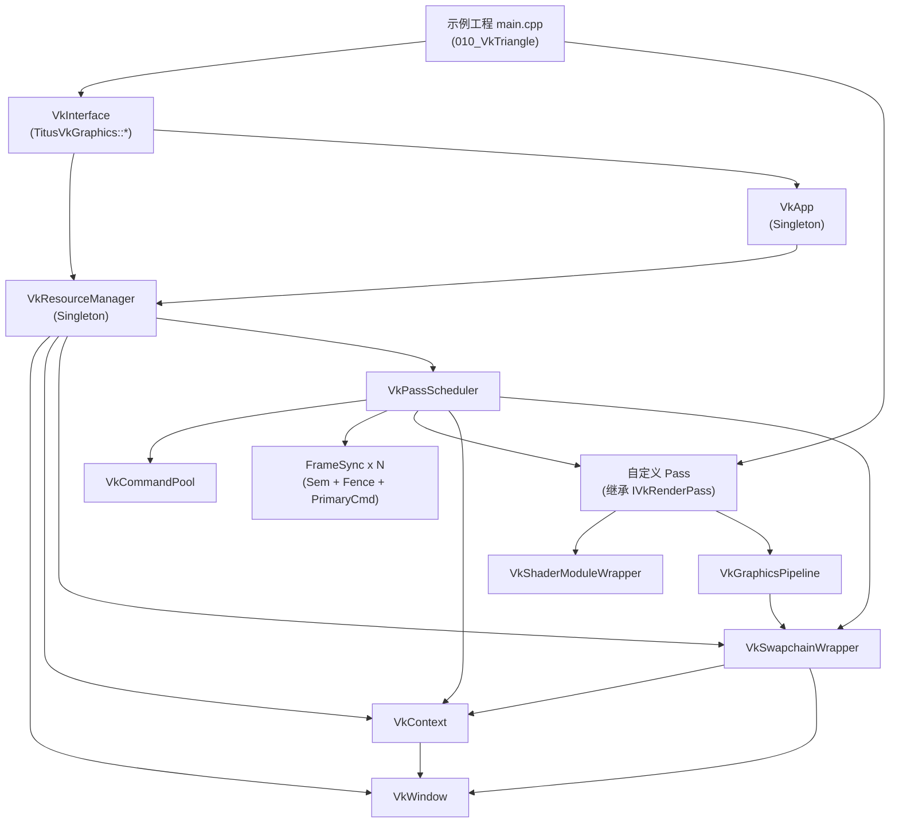
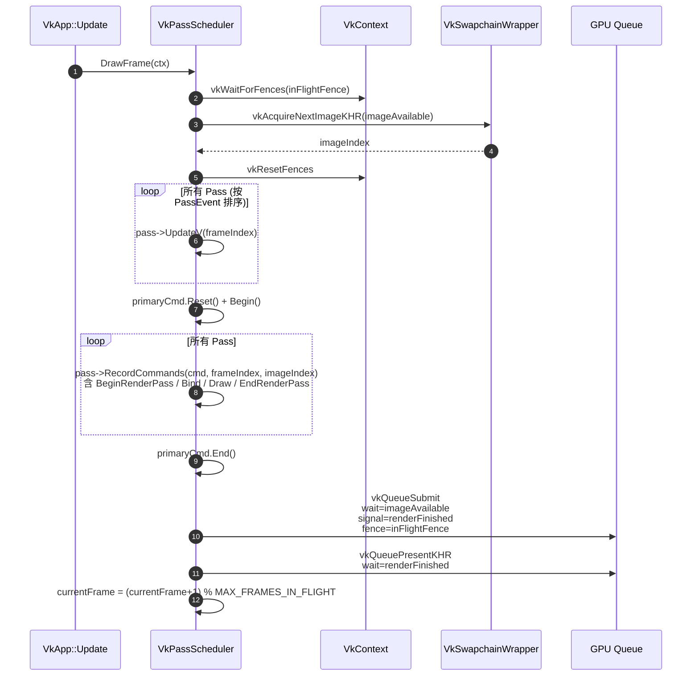

# RendererVK 架构分析

> ⚠️ **历史存档（已废弃）**：本文描述的是 **早期"独立骨架"** 版本的 RendererVK
> ——`VkApp` / `VkInterface` / `VkResourceManager` / `VkPassScheduler` / `IVkRenderPass`
> + `VkGraphicsPipeline` / `VkShaderModuleWrapper` 等。这套代码已随旧路径**整体清退删除**，
> 不再是当前实现。文中的依赖图、帧循环（`VkPassScheduler::DrawFrame`）、"写一个新 Pass
> 继承 `IVkRenderPass`"教程均**不再适用**。
>
> **当前实现**：RendererVK 现在只承担"Vulkan 设备实现"（`VKDevice`/`VKCommandList`/
> `VKTranslate`/`VKShaderCompiler`），帧循环由后端无关的 `RendererCore::PassScheduler`
> 统一驱动，业务 Pass 继承 `RendererCore::IRenderPass`。请以
> [`../../Docs/Architecture/20_RendererVK.md`](../../Docs/Architecture/20_RendererVK.md)
> 为准；本文仅作为理解 Vulkan 底层步骤（第 5 节"把三角形画到窗口的步骤"）的学习性参考保留。

> 本文是对早期 Vulkan 后端"独立骨架"的整体架构梳理。  
> 阅读对象：希望理解 Vulkan 分层、并搞清楚"画一个三角形到窗口"具体要走哪些 Vulkan 步骤的开发者。

---

## 1. 项目定位

`RendererVK` 是把原 OpenGL 版本 [Renderer/](../../Renderer) 按照同样的语义模型，使用 **Vulkan 1.2+** 重新实现的渲染后端骨架。其设计目标是：

- 保持与 OpenGL 版本几乎一致的对外用法（`Interface.h` ↔ `VkInterface.h`）。
- 把 Vulkan 特有但繁琐的概念（Instance / Device / Swapchain / 同步对象 / Pipeline / 命令缓冲）封装成可复用模块，让示例工程（如 [010_VkTriangle/](../../010_VkTriangle)）只需要继承 `IVkRenderPass` 写一个 Pass 即可工作。
- 仍然采用 **"PassEvent 排序 + Scheduler 统一调度"** 的渲染管线组织方式。

---

## 2. 模块总览

```
RendererVK/
├─ Common.h / Common.cpp              全局配置 / 枚举 / VK_CHECK 宏
├─ RENDERER_VK_EXPORTS.h              DLL 导出宏
├─ VkWindow.{h,cpp}                   GLFW 窗口 + VkSurface
├─ VkContext.{h,cpp}                  Instance / DebugMessenger / PhysicalDevice / Device / Queue
├─ VkSwapchainWrapper.{h,cpp}         Swapchain / ImageView / DepthBuffer / 默认 RenderPass / Framebuffer
├─ VkShaderModuleWrapper.{h,cpp}      SPIR-V Shader 模块封装
├─ VkGraphicsPipeline.{h,cpp}         VkPipeline + VkPipelineLayout（含完整状态）
├─ VkCommandBufferWrapper.{h,cpp}     Primary/Secondary CommandBuffer 封装
├─ IVkRenderPass.{h,cpp}              渲染 Pass 抽象基类（逻辑 Pass，非 VkRenderPass）
├─ VkPassScheduler.{h,cpp}            帧调度 + Fence/Semaphore 同步 + CommandPool
├─ VkResourceManager.{h,cpp}          单例资源中心，持有 Window/Context/Swapchain/Scheduler
├─ VkApp.{h,cpp}                      主应用循环（Init / Update / Shutdown / FPS）
└─ VkInterface.{h,cpp}                对外门面 API（命名空间 TitusVkGraphics::*）
```

### 2.1 模块职责清单

| 模块 | 关键类型 / 函数 | 职责 |
|---|---|---|
| `Common` | `TitusVkGraphics::WINDOW_KEYWORD`、`COMPONENT_CONFIG`、`ERenderPassEvent`、`QueueFamilyIndices`、`SwapchainSupportDetails`、`VK_CHECK` | 全局配置、Vulkan 错误检查宏、Pass 排序枚举、队列族/交换链查询结果等基础结构。 |
| `VkWindow` | `Init()`、`CreateSurface(VkInstance)`、`IsResized()` | 用 GLFW 创建窗口，Vulkan 模式下不再创建 OpenGL Context；通过 `glfwCreateWindowSurface` 生成 `VkSurfaceKHR`。 |
| `VkContext` | `CreateInstance`、`SetupDebugMessenger`、`PickPhysicalDevice`、`CreateLogicalDevice` | Vulkan "全局上下文"：`VkInstance` / `VkDebugUtilsMessengerEXT` / `VkPhysicalDevice` / `VkDevice` / `VkQueue`（graphics + present）。 |
| `VkSwapchainWrapper` | `CreateSwapchain`、`CreateImageViews`、`CreateDepthResources`、`CreateDefaultRenderPass`、`CreateFramebuffers`、`Recreate` | 显式 Swapchain；同时提供一个含 Color+Depth 附件的默认 `VkRenderPass` 与对应的 `VkFramebuffer[]`，供普通几何 Pass 直接复用。窗口 Resize 时整体重建（保留 RenderPass）。 |
| `VkShaderModuleWrapper` | 从 `.spv` 字节码加载 → `VkShaderModule`；提供 `GetStageCreateInfo()` | 因为 Vulkan 只接受 SPIR-V，构建期把 `.vert/.frag` 由 `glslc` 编译成 `.spv`，运行期加载即可。 |
| `VkGraphicsPipeline` | `VkPipelineConfig::Default(extent)`、`Build(ctx, shaders, renderPass, cfg)`、`Bind(cmd)` | 把 Vulkan Pipeline 八件套（Shader 阶段 / VertexInput / InputAssembly / Viewport / Rasterizer / Multisample / DepthStencil / ColorBlend / DynamicState / PipelineLayout）打包，简化创建。 |
| `VkCommandBufferWrapper` | `Init / Reset / Begin / End`、`BeginRenderPass`、`SetViewport / SetScissor`、`BindPipeline`、`Draw / DrawIndexed` | 真实的 `VkCommandBuffer` 封装；语义对应 OpenGL 版的 `RenderCommandBuffer`，但是直写 GPU 指令而不是延迟队列。 |
| `IVkRenderPass` | `InitV / DestroyV / UpdateV / RecordCommands`、`m_passEvent`、`operator<` | "逻辑 Pass" 抽象基类（不是 `VkRenderPass`！），描述一次绘制阶段，按 `ERenderPassEvent` + `subOrder` 全局排序。 |
| `VkPassScheduler` | `CreateCommandPool`、`CreateSyncObjects`、`AddPass`、`DrawFrame` | 帧调度核心：管理 `MAX_FRAMES_IN_FLIGHT` 个 `FrameSync{ imageAvailable, renderFinished, inFlightFence, primaryCmd }`，每帧 Acquire → CPU 更新 → 录制 → Submit → Present。 |
| `VkResourceManager` | `Init / Destroy`、`RegisterRenderPass`、共享数据池 | 单例；按确定顺序构造 `Window → Context → Swapchain → Scheduler`，并在 `Init` 时把挂起的 Pass 统一 `InitV` + `AddPass`。 |
| `VkApp` | `Init / Update / Shutdown`、`CalculateTime`、`GetFramesPerSecond` | 主循环：`while (!glfwWindowShouldClose) { glfwPollEvents(); scheduler->DrawFrame(ctx); }`；退出时 `vkDeviceWaitIdle`。 |
| `VkInterface` | `WINDOW_KEYWORD::*`、`COMPONENT_CONFIG::*`、`RESOURCE_MANAGER::RegisterRenderPass`、`APP::Init/Update/ShutdownApp` | 对外门面 API；`main.cpp` 只依赖这一个头即可使用整个渲染框架。 |

### 2.2 OpenGL ↔ Vulkan 模块映射

| 角色 | OpenGL `Renderer/` | Vulkan `RendererVK/` |
|---|---|---|
| 主循环 | `App` | `VkApp` |
| 窗口 | `GLFWWindow` | `VkWindow` |
| 上下文 | *隐式（驱动管理）* | `VkContext`（必须显式管理） |
| 交换链 | *无（GLFW SwapBuffers 即可）* | `VkSwapchainWrapper` |
| Shader | `ShaderModule` | `VkShaderModuleWrapper`（仅接受 SPIR-V） |
| Program / 管线 | `ShaderProgram` + 状态机 | `VkGraphicsPipeline`（immutable PSO） |
| 命令缓冲 | `RenderCommandBuffer`（`std::function` 延迟队列） | `VkCommandBufferWrapper`（真实 GPU 指令缓冲） |
| Pass 抽象 | `IRenderPass` | `IVkRenderPass` |
| 调度器 | `RenderPassScheduler` | `VkPassScheduler`（多了 Fence/Semaphore 同步） |
| 资源管理 | `ResourceManager` | `VkResourceManager` |
| 对外 API | `Interface.h` | `VkInterface.h` |

---

## 3. 依赖关系图



依赖（构造）顺序由 `VkResourceManager::Init()` 固定为：

```
VkWindow::Init()
  → VkContext::Init(window)        // 需要 surface
    → VkSwapchainWrapper::Init(ctx, window)  // 需要 device + surface
      → VkPassScheduler::Init(ctx, swapchain, window)   // 需要 queue + framebuffer
        → 对每个挂起 Pass 调 InitV(ctx) 并 AddPass()
```

销毁顺序与构造严格相反，并且在 `VkApp::Update()` 退出后会先 `vkDeviceWaitIdle` 确保 GPU 不再使用任何资源。

---

## 4. 帧循环（DrawFrame）流程

`VkApp::Update()` 每帧只做一件事：调用 `VkPassScheduler::DrawFrame(ctx)`。



同步关键点：

- `inFlightFence`（CPU↔GPU）：保证主机不会过快地再次复用同一帧的命令缓冲。
- `imageAvailable`（GPU↔GPU，颜色输出阶段）：保证 GPU 在交换链图像真正就绪前不写颜色附件。
- `renderFinished`（GPU↔GPU）：保证 Present 在渲染完成后才发生。

---

## 5. 用 Vulkan 把一个三角形画到窗口必须做的步骤

下面这份清单是"把 Vulkan 跑起来到看到一个三角形"的最小必要步骤。每一步都标注了在本仓库里的实现位置，便于对照源码。

### 5.1 一次性初始化（Init 阶段）

| # | 步骤 | 关键 Vulkan 调用 | 仓库实现位置 |
|---|---|---|---|
| 1 | **创建窗口**（GLFW，禁用 OpenGL Context） | `glfwInit` → `glfwWindowHint(GLFW_CLIENT_API, GLFW_NO_API)` → `glfwCreateWindow` | [VkWindow.cpp](../VkWindow.cpp) `VkWindow::Init` |
| 2 | **创建 VkInstance**（声明 App + 启用扩展 + 可选验证层） | `vkCreateInstance`，扩展含 `VK_KHR_surface` + 平台 `VK_KHR_*_surface` + `VK_EXT_debug_utils` | [VkContext.cpp](../VkContext.cpp) `CreateInstance` |
| 3 | **（可选）安装 Debug Messenger**（验证层回调） | `vkCreateDebugUtilsMessengerEXT` | `VkContext::SetupDebugMessenger` |
| 4 | **创建 VkSurfaceKHR**（把 GLFW 窗口"接到" Vulkan） | `glfwCreateWindowSurface` | `VkWindow::CreateSurface`，由 `VkContext::Init` 调用 |
| 5 | **挑选 VkPhysicalDevice**（找一块支持图形+呈现+SwapchainExt 的 GPU） | `vkEnumeratePhysicalDevices` + `vkGetPhysicalDeviceQueueFamilyProperties` + `vkGetPhysicalDeviceSurfaceSupportKHR` | `VkContext::PickPhysicalDevice` / `IsDeviceSuitable` / `FindQueueFamilies` |
| 6 | **创建 VkDevice + VkQueue**（图形队列 + 呈现队列；启用 `VK_KHR_swapchain` 设备扩展） | `vkCreateDevice` → `vkGetDeviceQueue` | `VkContext::CreateLogicalDevice` |
| 7 | **查询交换链能力**（Format / PresentMode / Extent） | `vkGetPhysicalDeviceSurfaceCapabilitiesKHR` 等三件套 | `VkContext::QuerySwapchainSupport` + `VkSwapchainWrapper::Choose*` |
| 8 | **创建 VkSwapchainKHR + 取出 VkImage[]** | `vkCreateSwapchainKHR` → `vkGetSwapchainImagesKHR` | `VkSwapchainWrapper::CreateSwapchain` |
| 9 | **为每个 Swapchain 图像创建 VkImageView** | `vkCreateImageView`（2D / Color） | `VkSwapchainWrapper::CreateImageViews` |
| 10 | **（可选但推荐）创建 Depth 资源**：`VkImage` + `VkDeviceMemory` + `VkImageView` | `vkCreateImage` → `vkAllocateMemory` → `vkBindImageMemory` → `vkCreateImageView` | `VkSwapchainWrapper::CreateDepthResources` |
| 11 | **创建 VkRenderPass**（声明 Color/Depth 附件、Subpass、SubpassDependency） | `vkCreateRenderPass` | `VkSwapchainWrapper::CreateDefaultRenderPass` |
| 12 | **为每个 Swapchain 图像创建 VkFramebuffer**（绑定到上面 RenderPass） | `vkCreateFramebuffer` | `VkSwapchainWrapper::CreateFramebuffers` |
| 13 | **创建 VkCommandPool**（指向图形队列族） | `vkCreateCommandPool` | `VkPassScheduler::CreateCommandPool` |
| 14 | **分配每帧的 Primary VkCommandBuffer** | `vkAllocateCommandBuffers` | `VkCommandBufferWrapper::Init`，由 `CreateSyncObjects` 循环调用 |
| 15 | **创建同步对象**：每帧 1×`VkFence` + 2×`VkSemaphore`（imageAvailable / renderFinished） | `vkCreateFence` / `vkCreateSemaphore` | `VkPassScheduler::CreateSyncObjects` |
| 16 | **加载 SPIR-V 字节码 → VkShaderModule**（vert + frag） | `vkCreateShaderModule` | `VkShaderModuleWrapper` 构造函数 |
| 17 | **创建 VkPipelineLayout**（DescriptorSetLayouts + PushConstants；最简三角形可全空） | `vkCreatePipelineLayout` | `VkGraphicsPipeline::Build` 内部 |
| 18 | **创建 VkPipeline（GraphicsPipeline）**：组装 Shader 阶段 + VertexInput + InputAssembly + Viewport + Rasterizer + Multisample + DepthStencil + ColorBlend + DynamicState，并指定第 11 步的 RenderPass | `vkCreateGraphicsPipelines` | `VkGraphicsPipeline::Build` |

> 第 16~18 步在本框架里就是 `IVkRenderPass::InitV`（如 [TrianglePass::InitV](../../010_VkTriangle/TrianglePass.cpp)）里做的事；第 1~15 步框架已经替你做好。

### 5.2 每帧必做（DrawFrame，对照 [VkPassScheduler::DrawFrame](../VkPassScheduler.cpp)）

| # | 步骤 | 关键 Vulkan 调用 |
|---|---|---|
| 1 | 等待上一帧同 slot 的 Fence | `vkWaitForFences(inFlightFence)` |
| 2 | 取一张 Swapchain 图像（顺便拿到 imageIndex） | `vkAcquireNextImageKHR(..., imageAvailable, ...)` |
| 3 | 处理 `VK_ERROR_OUT_OF_DATE_KHR` → 重建 Swapchain | `VkSwapchainWrapper::Recreate` |
| 4 | 重置 Fence | `vkResetFences` |
| 5 | 重置并开始录制 Primary CommandBuffer | `vkResetCommandBuffer` + `vkBeginCommandBuffer` |
| 6 | 开始 RenderPass（清屏 Color+Depth） | `vkCmdBeginRenderPass` |
| 7 | 设置动态视口 / 裁剪 | `vkCmdSetViewport` / `vkCmdSetScissor` |
| 8 | 绑定 Pipeline | `vkCmdBindPipeline` |
| 9 | （三角形顶点写死在 Shader 用 `gl_VertexIndex` 取，可省）绑定 VBO/IBO/DescriptorSet | `vkCmdBindVertexBuffers` / `vkCmdBindIndexBuffer` / `vkCmdBindDescriptorSets` |
| 10 | 发起 Draw | `vkCmdDraw(3, 1, 0, 0)` |
| 11 | 结束 RenderPass + 结束录制 | `vkCmdEndRenderPass` + `vkEndCommandBuffer` |
| 12 | 提交到图形队列（wait imageAvailable，signal renderFinished，fence inFlightFence） | `vkQueueSubmit` |
| 13 | 呈现到窗口（wait renderFinished） | `vkQueuePresentKHR` |
| 14 | `currentFrame = (currentFrame + 1) % MAX_FRAMES_IN_FLIGHT` | — |

> 第 6~11 步对应 `IVkRenderPass::RecordCommands`（如 [TrianglePass::RecordCommands](../../010_VkTriangle/TrianglePass.cpp)）；其余步骤由 `VkPassScheduler` 完成。

### 5.3 关停（Shutdown 阶段）

1. `vkDeviceWaitIdle(device)` —— **任何 vkDestroy* 之前必做**。
2. 逐 Pass 调 `DestroyV`（销毁 Pipeline / PipelineLayout / ShaderModule）。
3. 销毁同步对象、CommandPool（CommandBuffer 随 Pool 释放）。
4. 销毁 Framebuffers / DepthImage(+View+Memory) / ImageViews / Swapchain / RenderPass。
5. 销毁 Device → Surface → DebugMessenger → Instance。
6. 销毁窗口 → `glfwTerminate`。

---

## 6. 写一个新 Pass 需要做什么

继承 [IVkRenderPass](../IVkRenderPass.h) 并实现三个方法，参考 [TrianglePass](../../010_VkTriangle/TrianglePass.h)：

```cpp
class MyPass : public IVkRenderPass
{
public:
    MyPass(const std::string& name, TitusVkGraphics::ERenderPassEvent ev)
        : IVkRenderPass(name, ev) {}

    void InitV(VkContext& ctx) override
    {
        // 1) 加载 .spv → VkShaderModuleWrapper(vs / fs / ...)
        // 2) （如有）创建 DescriptorSetLayout / DescriptorPool / DescriptorSet
        // 3) （如有）创建 VertexBuffer / IndexBuffer / UniformBuffer
        // 4) 用 VkPipelineConfig::Default(extent) 配置后调用 m_pipeline.Build(...)
    }

    void DestroyV(VkContext& ctx) override
    {
        // 与 InitV 相反顺序销毁
    }

    void RecordCommands(VkContext& ctx, VkCommandBufferWrapper& cmd,
                        uint32_t frameIndex, uint32_t imageIndex) override
    {
        cmd.BeginRenderPass(swapchain->GetDefaultRenderPass(),
                            swapchain->GetFramebuffer(imageIndex), extent, clears);
        cmd.SetViewport(...); cmd.SetScissor(...);
        m_pipeline.Bind(cmd.Get());
        // vkCmdBindVertexBuffers / vkCmdBindDescriptorSets ...
        cmd.Draw(...);
        cmd.EndRenderPass();
    }
};
```

`main.cpp` 只需要：

```cpp
TitusVkGraphics::WINDOW_KEYWORD::SetWindowSize(1280, 720);
TitusVkGraphics::COMPONENT_CONFIG::SetEnableValidationLayer(true);

TitusVkGraphics::RESOURCE_MANAGER::RegisterRenderPass(
    std::make_shared<MyPass>("MyPass", TitusVkGraphics::ERenderPassEvent::OpaqueShading));

TitusVkGraphics::APP::InitApp();
TitusVkGraphics::APP::UpdateApp();
TitusVkGraphics::APP::ShutdownApp();
```

---

## 7. 当前已支持 / 暂未实现

**已支持**

- 完整的 Vulkan 启动/关闭流程（Instance/Device/Queue/Swapchain/RenderPass/Framebuffer）
- 验证层 + DebugUtilsMessenger
- 多帧 In-Flight + 完整 Fence/Semaphore 同步
- Swapchain Resize 自动重建
- 含深度附件的默认 RenderPass，可被任意几何 Pass 复用
- `IVkRenderPass` + `VkPassScheduler` 的 PassEvent 排序调度
- Pipeline / ShaderModule / CommandBuffer 的轻量封装

**暂未实现**（来自 [README.md](../README.md) TODO）

- Buffer / Image 通用封装（UBO/TBO/SSBO/Texture）
- DescriptorSet 管理器
- 顶点/索引上传（VkBuffer + VkDeviceMemory）
- ImGui Vulkan backend
- Camera / UBO4ProjectionWorld 迁移
- Mesh / Model 加载
- 多 Pass（ShadowMap / GBuffer / Lighting / PostProcess）

